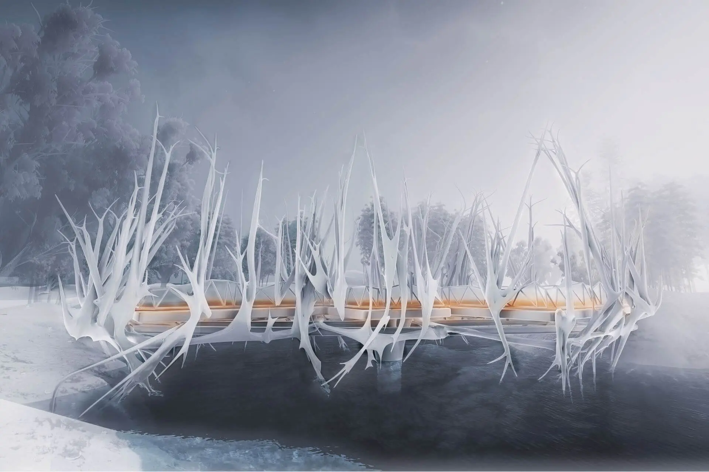

# Cubes of Growth – Footbridge design

Cubes of Growth is a pedestrian bridge concept generated through a plant-growth-inspired algorithm. The project uses digital rules to create an organic structure, then places that structure back into a natural site to produce a new spatial experience between infrastructure, landscape, and sculpture.

## Concept: Digital Growth in a Natural Site

The bridge is imagined as more than a linear connection across water. It becomes a spatial sequence where people move through a field of growing forms. The white branching elements echo roots, branches, and ice-covered trees, while the warm light along the deck gives the path a clear direction and a sense of safety.

## Growth Algorithm

The form is generated from a set of simple behaviors:

- **Nutrient points** move toward nearby nutrient or root points.
- **Root points** act as fixed sources that attract surrounding particles.
- **Gravity** pulls nutrient points downward during growth.
- **Phagocytosis** merges particles when they become close enough.
- **Exclusion** prevents overcrowding by controlling how particles search for nearby points.

By adjusting these rules, the project explores how a digital system can produce forms that feel biological without directly copying a plant.

## Bridge Deck Structure

The bridge deck was treated as a structural optimization problem. The process defines the structural boundary, generates random point schemes, creates Delaunay triangulation structures, evaluates them through finite element analysis, and uses a genetic algorithm to search for a lower-stress solution.

This combination of generative morphology and structural analysis allows the bridge to keep an organic visual language while still responding to engineering constraints.

## Spatial Experience

From a distance, the bridge reads as a soft, almost natural silhouette rather than a conventional engineered object. As visitors approach, the structure frames views of the water and surrounding trees. The contrast between the misty environment, the pale branching forms, and the illuminated walkway creates a quiet, immersive atmosphere.

<video src="/posts/cubes-footbridge/CubesofGrowth_x264.mp4" controls></video>

## Summary

The project treats the footbridge as a small public experience rather than only a crossing. By combining algorithmic growth, structural optimization, circulation, and light, Cubes of Growth proposes a bridge that can become a memorable place within the landscape.
