# Industrial 4.0+ 人机协作

Industrial 4.0+ 是一个面向工业生产场景的人机协作数字孪生系统。它把机器人、工人、生产线、动作数据和测试报告连接到同一套工作流中，让产线调整不再只依赖工程师经验或线下试错，而是可以先在虚拟空间中规划、仿真、验证，再逐步进入真实设备与真实人员的协作测试。

<video src="/posts/digital-twin/img/1623061433_x264.mp4"></video>

视频从工业 1.0 到工业 4.0 的演进切入：机械自动化程度越来越高，但完全自动化对大部分企业来说实现难度大、投入成本高，并不一定能带来更好的经济收益。项目因此提出“工业 4.0+”的方向，也就是从单纯追求机械自动化，转向更灵活、更可学习、更可规划的人机协同。

## 🦾 背景：人机协作

在传统生产线上，机器擅长高精度、重复性和高强度的任务，工人则擅长判断、应变、装配细节处理和异常情况归纳。但两者之间往往存在一道“自动化边界”：越靠近机器一侧，自动化成本和系统复杂度越高；越靠近工人一侧，重复劳动比例越高，生产效率和稳定性又会受到限制。

[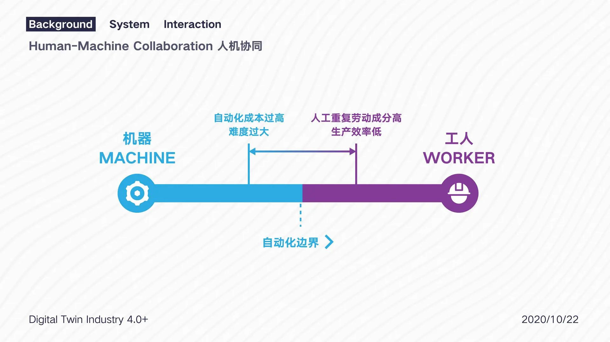](./img/1624250777_Page_02.webp)

人机协作的价值，就是把机器与工人从简单替代关系转变为互补关系。系统不要求所有动作都一次性被自动化，而是让机器承担稳定、可计算、可复现的部分，让工人保留灵活处理和现场判断能力。这样既能降低自动化改造难度，也能减少人工重复劳动带来的疲劳和误差。

[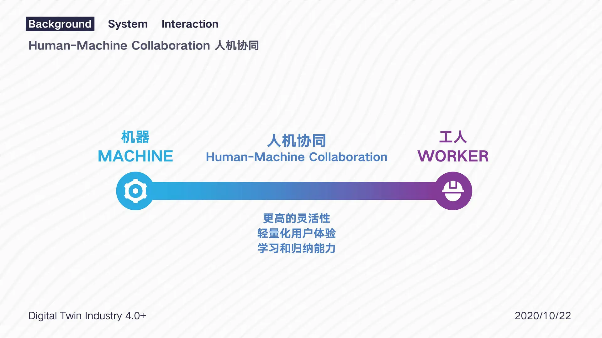](./img/1624250827_Page_03.webp)

数据也显示，人机协作后，工人的心理疲劳和生理疲劳程度都有所缓解。因此，这个项目关注的不是单一机械臂的控制，而是一个更完整的问题：当生产线中同时存在工人、机器人、传感器和 AR 设备时，如何让动作规划、空间布置、安全验证和测试反馈形成闭环。

## 🗺️ 系统：数字孪生系统图

系统以数字孪生模型为核心，把真实生产线中的设备数据、工人动作数据、人体工程学数据和测试记录整合起来。它包含五个主要环节：构建动作序列、AR 生产线调整、虚人虚机测试、真人虚机测试、真人真机测试。每个环节都不是孤立界面，而是会把数据传递给下一阶段。

[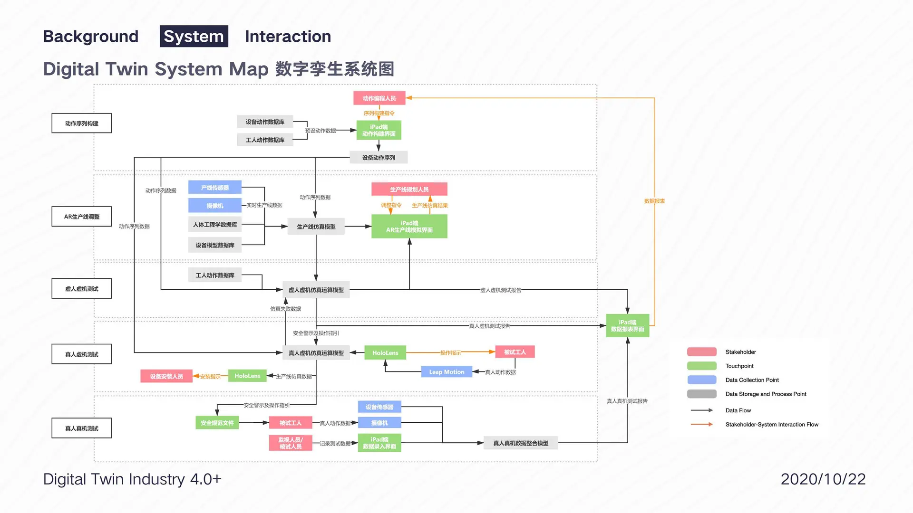](./img/1624250840_Page_04.webp)

在数据层面，设备模型数据库和工人动作数据库为动作编排提供基础；摄像机、生产线传感器、Leap Motion、HoloLens 和 iPad 则承担不同阶段的数据采集与交互入口。系统最终会把仿真结果、测试过程和现场反馈整理成报告，供动作编辑人员和生产线规划人员继续优化方案。

## 👨‍💻️ 交互：数字孪生工业 4.0+

整个交互流程按照风险由低到高、现实参与度由弱到强的顺序展开。先在平板上定义动作，再通过 AR 调整产线布局；随后用虚拟人和虚拟机器做初步仿真，用真实人和虚拟机器验证工人的体验与安全边界，最后进入真实工人与真实机器的测试。这样的分层验证可以减少直接在真实产线上试错的成本。

### 构建动作序列

动作序列是系统的起点。操作人员可以在 iPad 端从动作库中选择机器动作和工人动作，把它们拖拽到时间线或动作画布上，并通过参数面板调整每个动作的细节。

[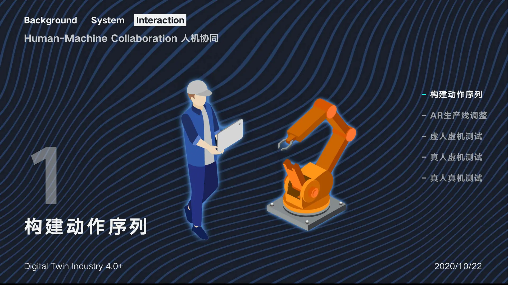](./img/1624250852_Page_11.webp)

界面被分成动作库、动作构建画布和动作预览区域。动作库中保存了机械臂抓取、移动、释放等设备动作，也保存了工人取放、检查、装配等人工动作。操作人员不需要从代码层面编写控制逻辑，而是通过组合动作单元建立协作流程。

[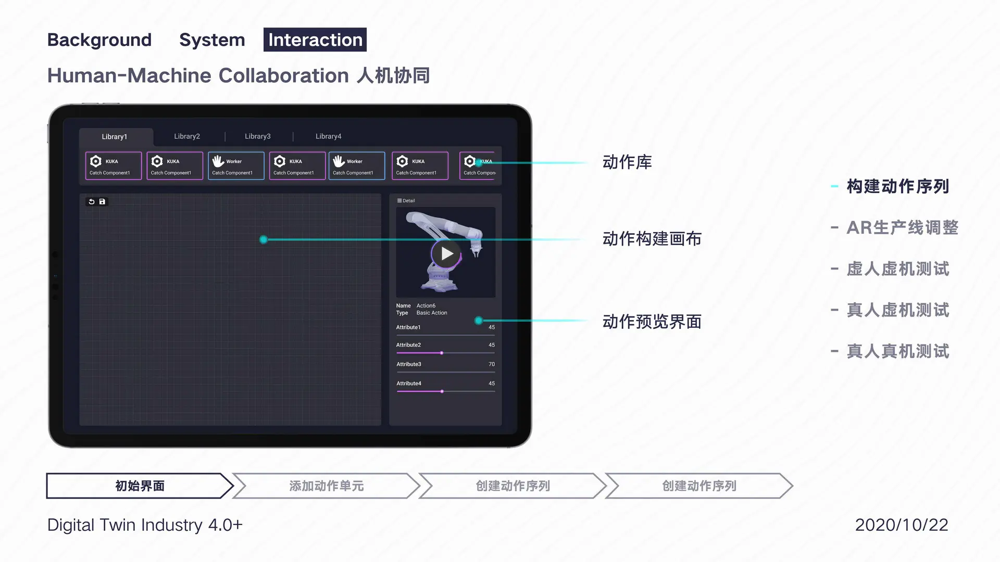](./img/1624251060_Page_12.webp)

添加动作单元时，系统会区分机器动作与工人动作，并用不同颜色表达两类执行主体。这样可以让动作序列的职责分配更清晰，也方便后续检查人和机器在时间与空间上的交叉关系。

[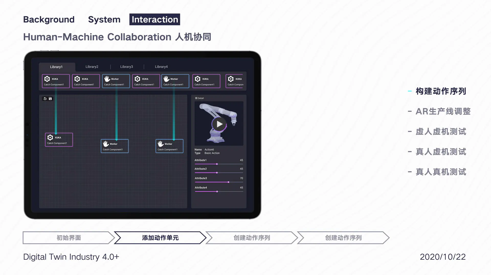](./img/1624251072_Page_13.webp)

动作之间的连接表达了生产任务的先后顺序，也表达了动作之间的依赖关系。比如机器人完成抓取后，工人才进入装配环节；或工人完成检查后，机器人再执行下一步移动。系统通过这种可视化编排，把原本隐藏在程序和口头经验里的协作逻辑变成可讨论、可修改的方案。

[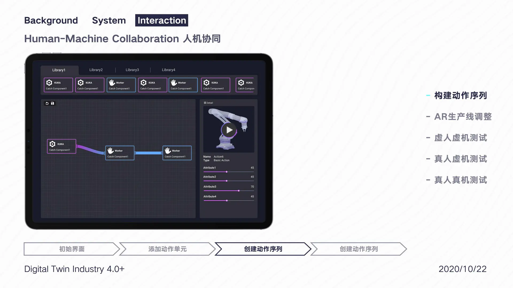](./img/1624251084_Page_14.webp)

在动作预览界面中，操作人员可以播放单个动作，查看机械臂轨迹和动作姿态，并调整速度、位置、等待时间等参数。这个阶段的重点不是追求最终产线效果，而是先保证每个动作单元本身可理解、可复用、可被后续测试系统识别。

[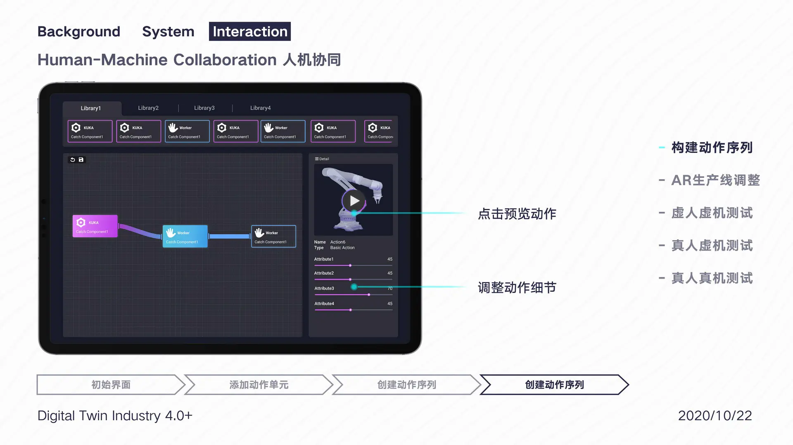](./img/1624251103_Page_15.webp)

### 使用 AR 调整生产线

当动作序列被初步建立后，系统进入生产线布置阶段。AR 的作用不是简单地把模型叠加到画面上，而是帮助规划人员在真实空间中预览设备、工人和操作区域之间的关系。

[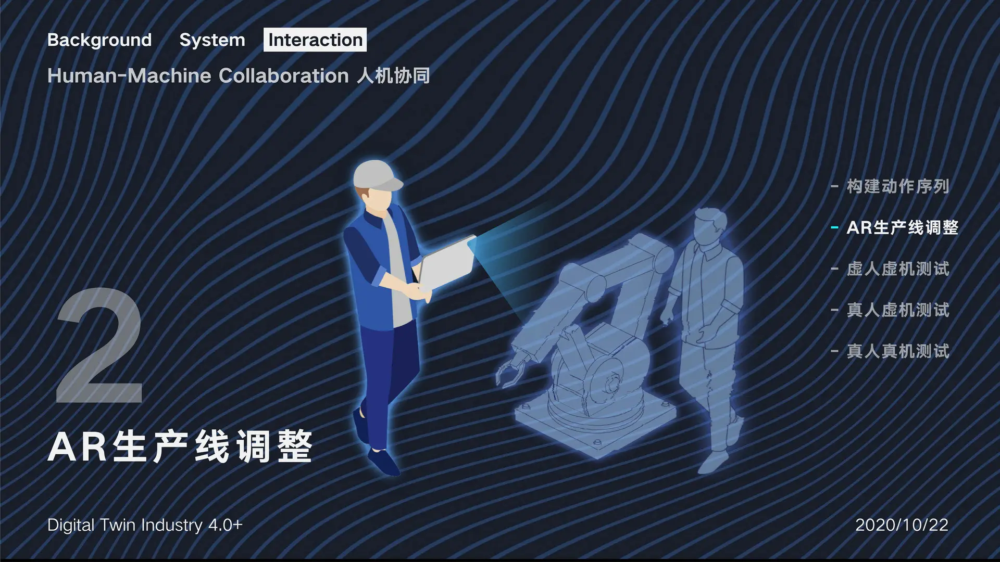](./img/1624251351_Page_16.webp)

在 iPad 端，规划人员可以进入真实车间画面，选择需要加入或移除的设备孪生体，并按照系统引导完成生产单元调整。底部步骤条把复杂操作拆成几个连续阶段：选择设备、扫描平面与放置、选择预设动作、确认布局方案。

[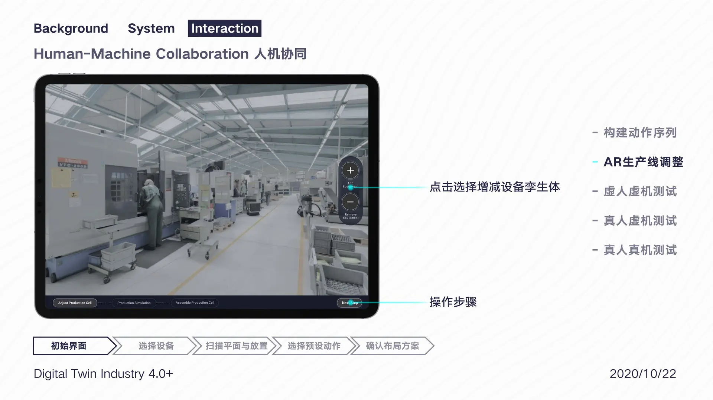](./img/1624251364_Page_17.webp)

选择设备时，系统会同时显示设备类型、工人模型和对应动作序列。这样规划人员在放置设备前，就能理解这个单元会承担什么生产任务，而不是只看到一个孤立的 3D 模型。

[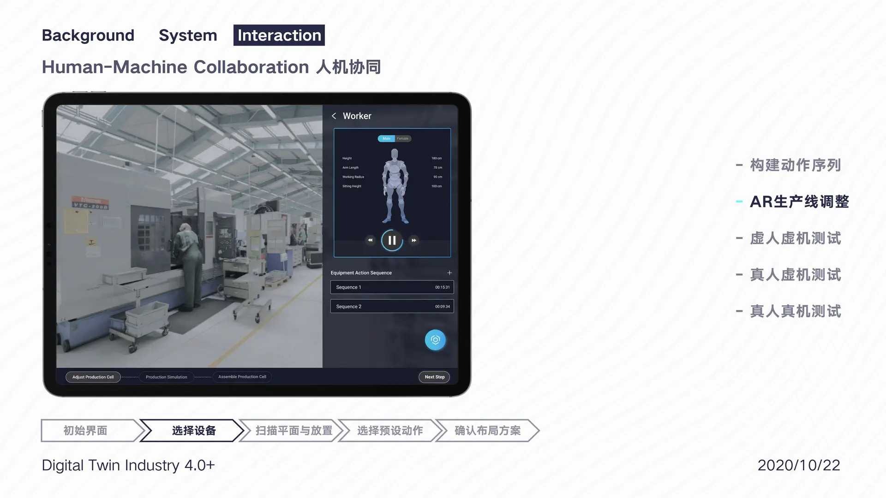](./img/1624251386_Page_21.webp)

放置阶段会检查平面平整度、碰撞风险、实际占地半径和干涉范围半径。红色区域用于提示潜在危险或不可放置区域，帮助规划人员在真实环境中提前发现空间冲突。相比在二维平面图中调整布局，AR 能更直接地呈现设备与人的尺度关系。

[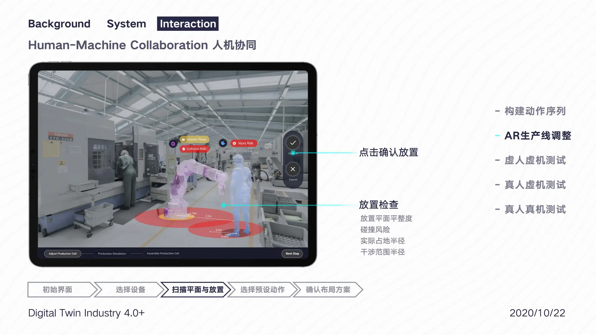](./img/1624251397_Page_22.webp)

确认设备位置后，规划人员可以为该设备选择预设动作序列。系统会把动作序列和空间布局绑定，为后续仿真测试提供输入。

[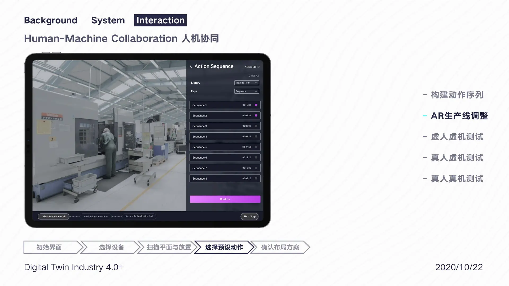](./img/1624251408_Page_24.webp)

最终确认布局方案时，界面会显示设备数量、工人数量、运行控制按钮和安全区域。规划人员可以在进入下一阶段前再次检查协作关系，避免把明显不合理的方案带入后续测试。

[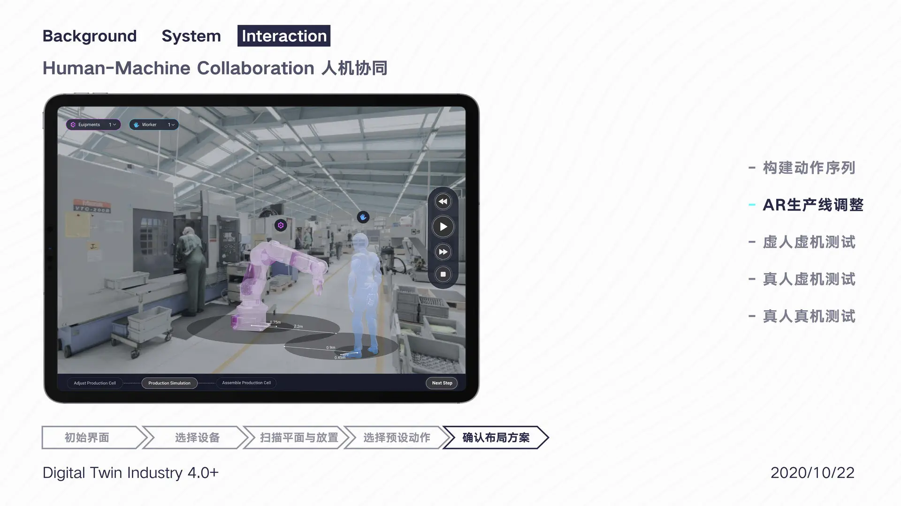](./img/1624251516_Page_25.webp)

### 虚拟人与虚拟机之间的测试

虚人虚机测试是风险最低的一层验证。它在虚拟场景中模拟工人与设备的协作过程，用来检查动作时序、空间干涉、等待时间和产线数据流。

[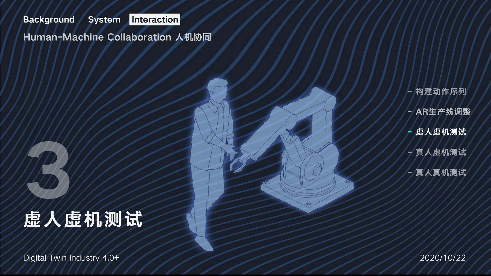](./img/1624253497_Page_26.webp)

测试开始后，系统会实时显示生产单元状态，例如设备产能、动作耗时和多设备之间的数据流。规划人员可以观察某个设备是否长时间等待、某个工人动作是否成为瓶颈，或者某段动作是否存在潜在碰撞。

[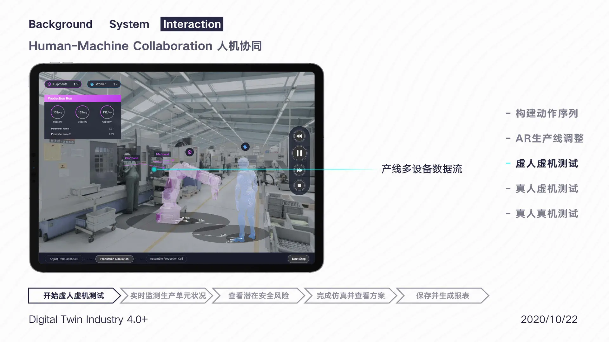](./img/1624253505_Page_27.webp)

系统也会以地图和标记的方式展示设备、工人和当前观察位置，让测试人员在复杂产线中快速定位问题。对于大规模生产单元，这种概览可以减少在多个设备之间来回查找的成本。

[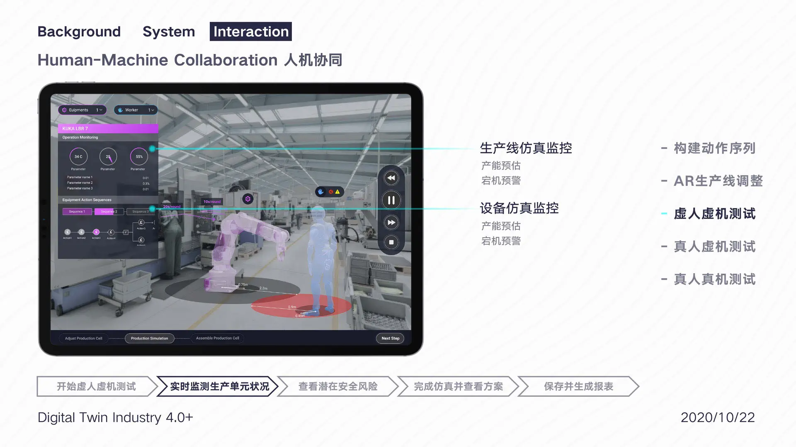](./img/1624253515_Page_28.webp)

当发现潜在安全风险时，系统会把风险位置和影响范围可视化。测试人员可以暂停仿真、回看动作过程，并判断问题来自动作顺序、设备位置还是工人路径。

[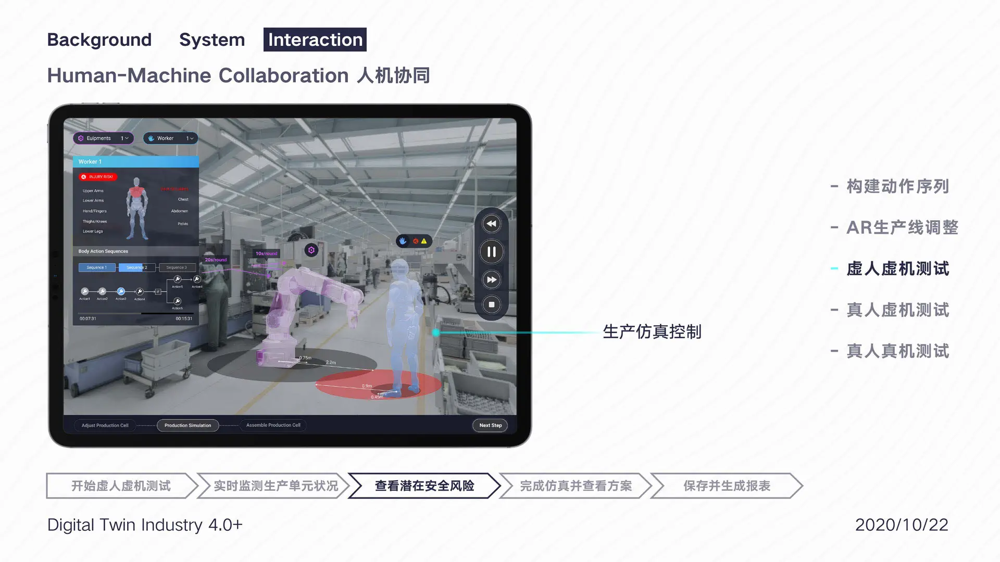](./img/1624253525_Page_29.webp)

完成仿真后，系统会把验证结果转化为安装与调整方案。方案中包含设备安装位置、操作指令和安全提示，为下一步进入真实空间做准备。

[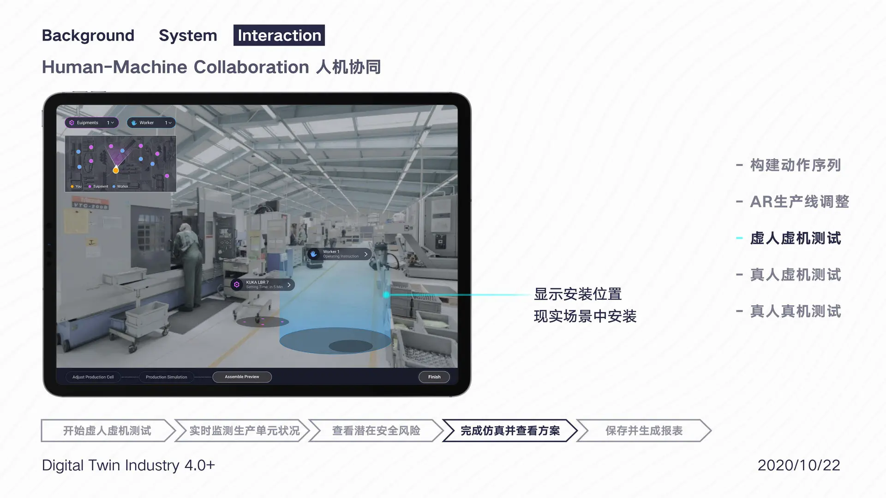](./img/1624253536_Page_30.webp)

测试报告会记录每次仿真的数据。比如某个动作的总耗时、等待时间、异常记录和主观评价入口。通过多次测试数据的叠加，规划人员可以比较不同方案的效率和安全性，而不是只凭一次演示判断方案是否可行。

[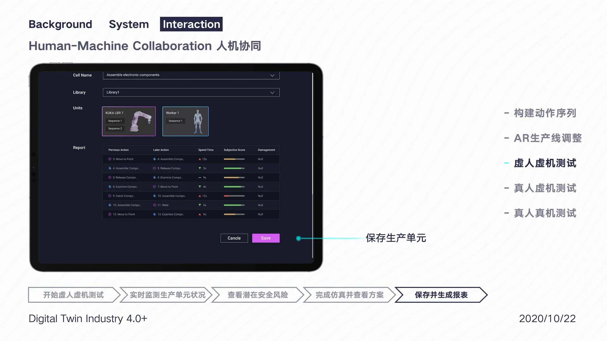](./img/1624253595_Page_32.webp)

### 真实人与虚拟机之间的测试

当虚拟仿真通过后，系统引入真实工人，但设备仍然保持为虚拟机器。这个阶段可以测试工人的真实动作范围、视线、站位和操作舒适度，同时避免真实机械臂带来的安全风险。

[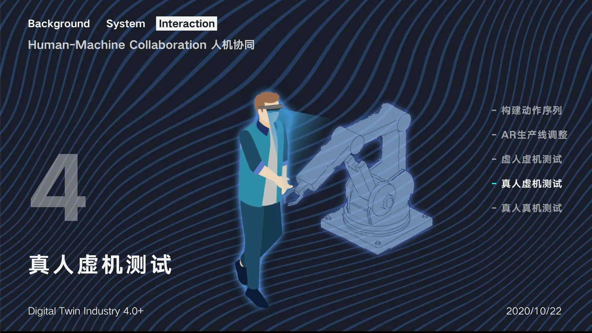](./img/1624253617_Page_33.webp)

工人佩戴 HoloLens 后，可以在真实空间中看到虚拟生产单元和设备动作。系统也会配合 Leap Motion 捕捉手部数据，让工人的真实动作可以和虚拟机械臂的运动轨迹一起被记录和分析。系统先让工人选择测试单元，再进入真人虚机测试流程。

[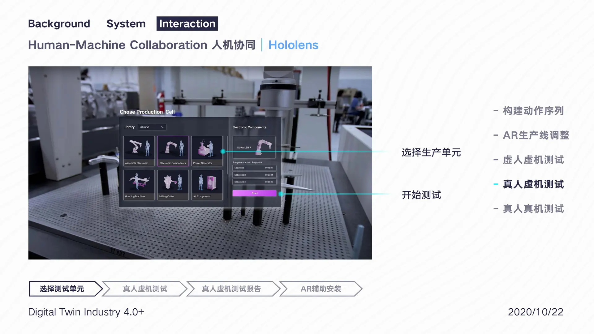](./img/1624253655_Page_34.webp)

测试过程中，虚拟机械臂会在真实空间中按照动作序列运行。上一阶段保存的安全风险数据会以保护框和文字提示的形式显示出来，提醒工人注意潜在危险区域。这样可以观察工人是否需要过度伸展、是否会被设备路径打断、是否能自然理解下一步操作。

[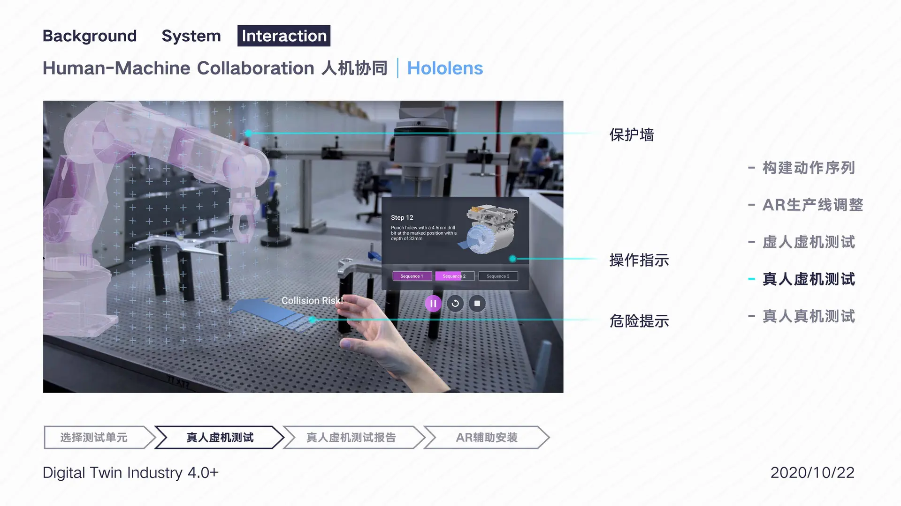](./img/1624253663_Page_35.webp)

完成测试后，系统会生成真人虚机测试报告。测试人员可以查看过程记录、动作耗时和主观反馈，把“能不能用”“累不累”“是否容易误解”这些体验问题也纳入产线设计。

[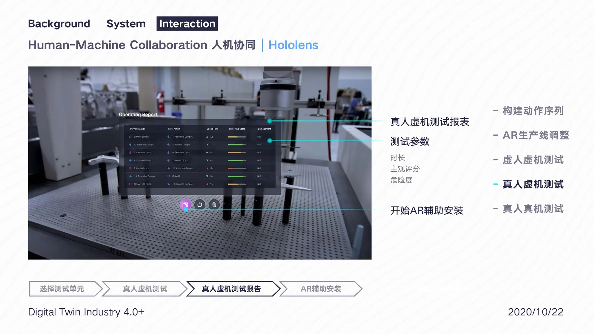](./img/1624253670_Page_36.webp)

如果方案需要安装真实设备，HoloLens 会把安装提示叠加在现场环境中，显示安装位置、定位点和具体操作步骤。这样数字孪生系统不仅服务于前期规划，也可以延伸到现场施工和设备部署。

[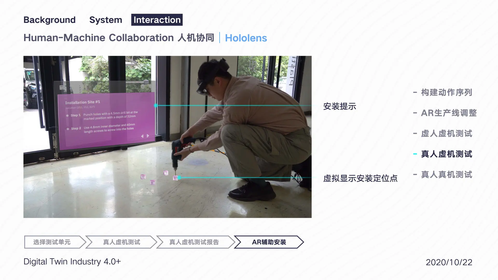](./img/1624253678_Page_37.webp)

### 真实人与真实机器之间的测试

最后一步是真人真机测试。此时系统进入最接近真实生产的状态：真实工人与真实机械臂协作运行，监视人员记录过程，被测人员完成任务，系统生成测试报告并交给编程人员继续优化。

[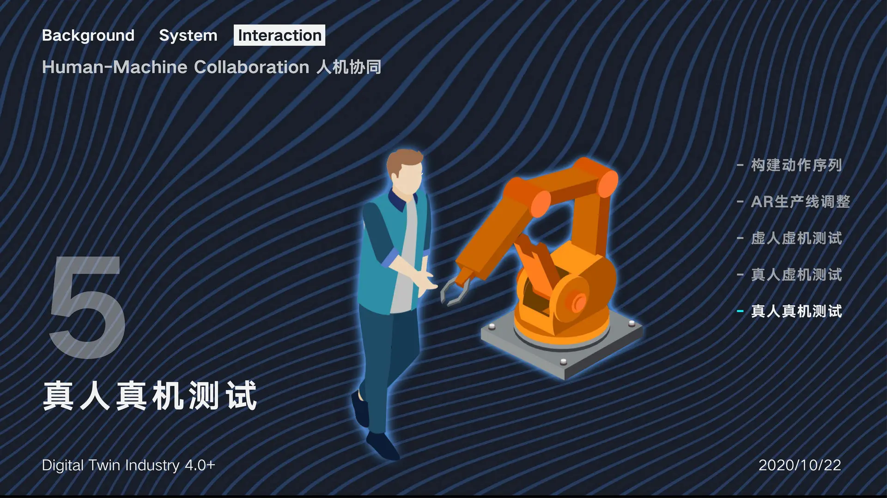](./img/1624254089_Page_38.webp)

在测试环境中，监视人员负责观察并记录测试过程，被测人员负责执行协作任务。两者之间的记录会被系统整合成测试报告，帮助编程人员判断动作序列是否需要调整。

[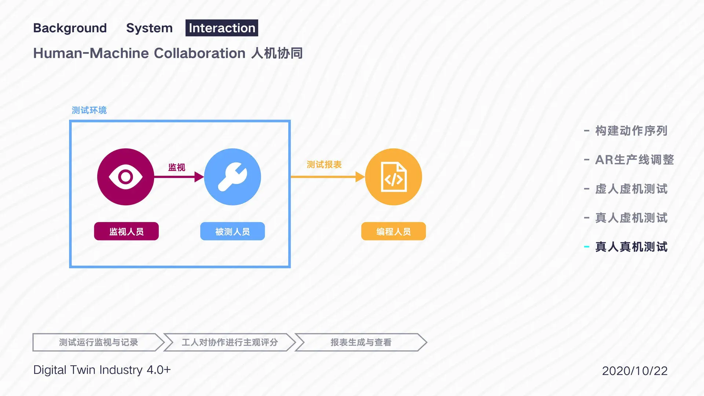](./img/1624254096_Page_39.webp)

真实测试关注的不只是机械臂能否完成动作，还包括工人与机器交接时是否顺畅、等待时间是否过长、协作节奏是否稳定，以及现场人员是否能清楚理解安全边界。被测工人完成测试后，还会对协作环节进行主观问卷评分，用来补充纯数据记录无法表达的体验问题。

[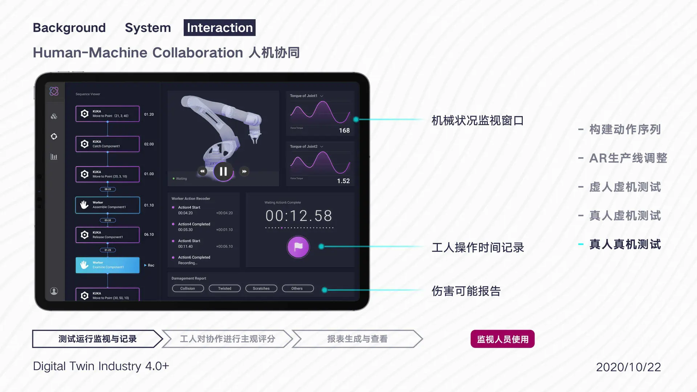](./img/1624254105_Page_40.webp)

测试运行时，系统会持续监控并记录动作过程。相比只在测试结束后总结问题，实时监控可以帮助现场人员快速发现异常，也方便后续回看具体发生问题的时间点。

[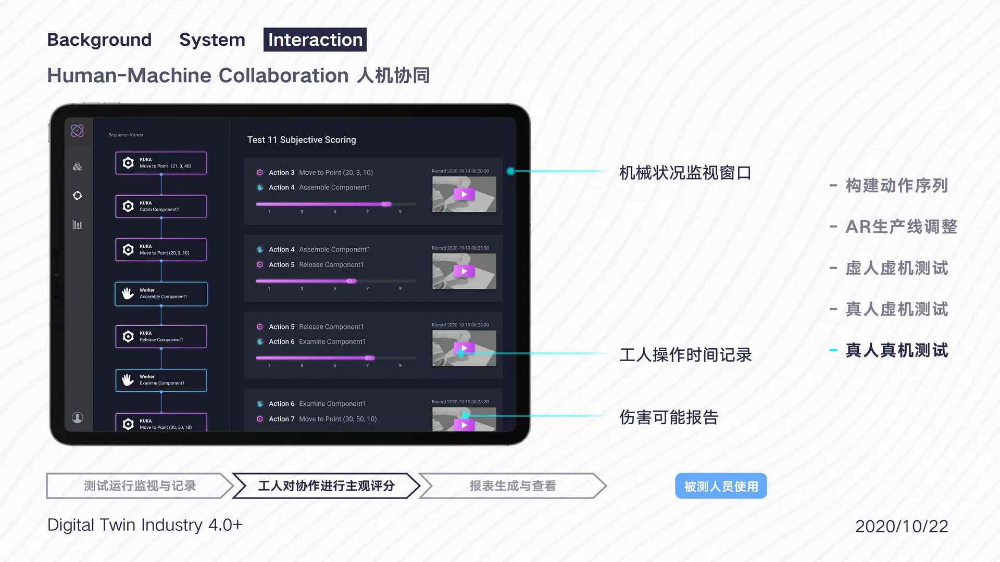](./img/1624254112_Page_41.webp)

最终报告把动作序列、每个动作耗时、等待时间、测试录像和交接环节评价放在同一个界面中。编程人员可以根据这些数据继续修改动作参数或调整协作顺序，让产线优化形成持续迭代。

[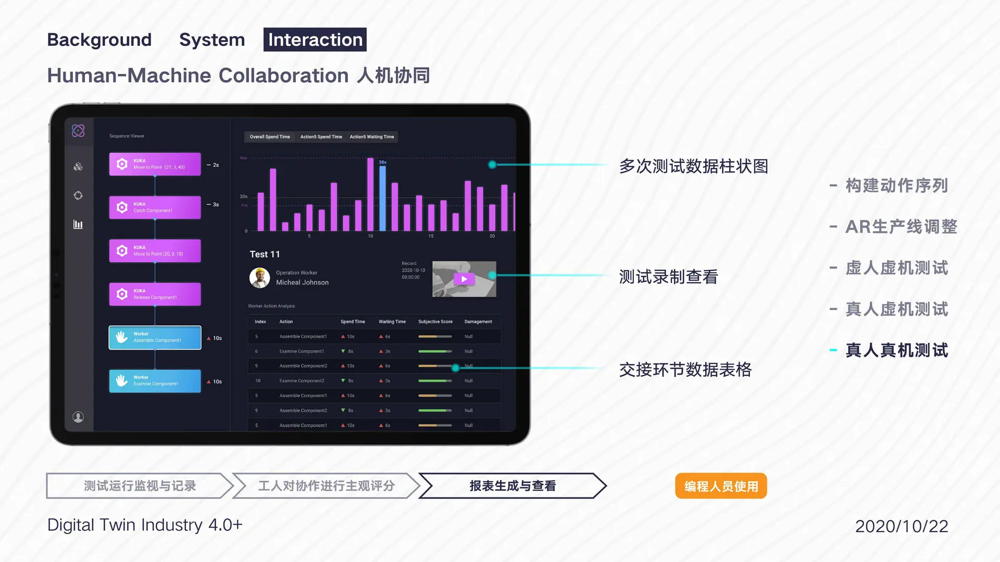](./img/1624254118_Page_42.webp)

## 💡 总结：从试错到可迭代的协作系统

这个项目尝试把人机协作从“现场调试”推进到“数字孪生驱动的迭代流程”。动作序列让协作任务可编辑，AR 让产线布置可感知，分层测试让风险逐步释放，测试报告让经验沉淀为数据。

它的重点不是用机器完全替代工人，而是让机器、工人和系统之间形成更清晰的分工：机器执行稳定动作，工人处理灵活任务，数字孪生系统负责连接规划、验证和反馈。对于工业 4.0+ 的生产环境来说，这种协作关系可能比单纯追求更高自动化更现实，也更容易被逐步落地。
