# Fluxor – 2040 Shanghai Mobility System

Fluxor is a speculative mobility system for the Yangtze River Delta in 2040. The project asks how transportation can do more than move people efficiently: it can also redistribute services, activate under-served suburban areas, and bring new social, cultural, and creative opportunities to communities that are usually treated as the edge of the city.

<video src="/posts/fluxor/FLUXOR.mp4" controls></video>

## Background: Suburban Life in Shanghai

The familiar image of Shanghai is often the skyline of the city center. Yet most residents experience the city from a very different position: long commutes, repetitive residential blocks, limited neighborhood services, and fewer places for evening entertainment or social activity.

Around 7 million people live in central Shanghai, while about 16 million live in suburban districts. When the lens expands to the whole Yangtze River Delta, the question becomes even larger: how can a metropolitan region with more than 150 million people offer richer everyday experiences outside the strongest urban cores?

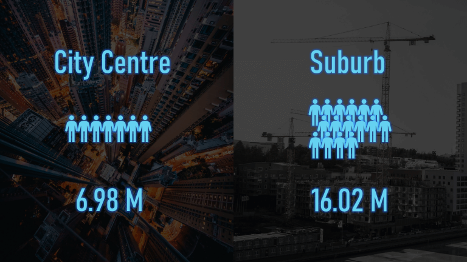

The daily pain points were then translated into four visual scenarios: tedious commuting, repetitive food choices, limited entertainment, and a lack of social activity. These images helped clarify that the problem was not only transportation time, but the thinness of everyday services around suburban life.

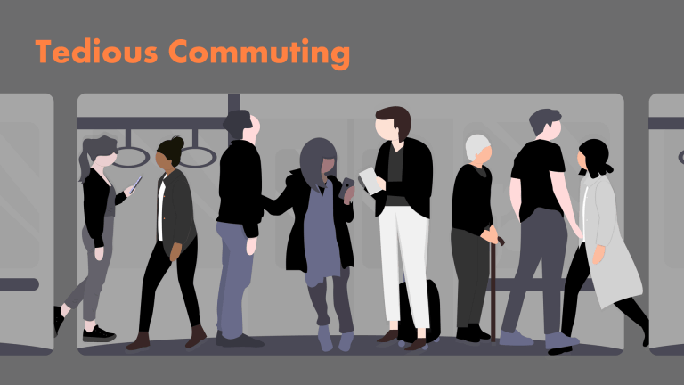

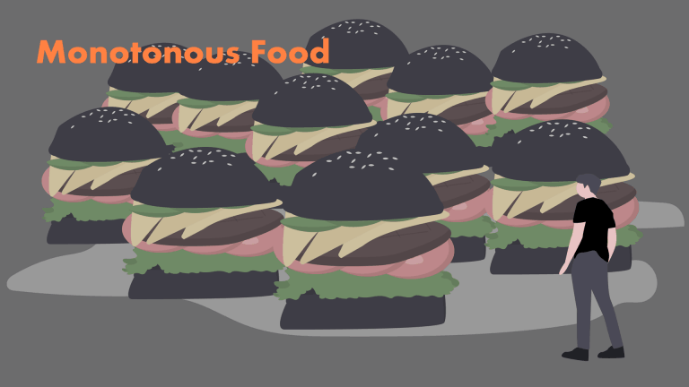

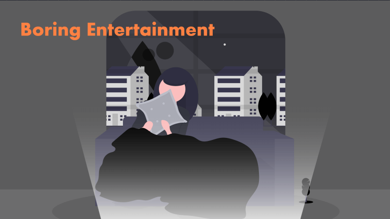

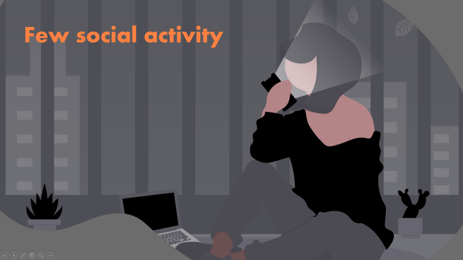

## Research: From Basic Demand to Advanced Demand

The project began by mapping residents' needs into a demand triangle. Basic needs include food, safety, healthcare, and employment. Advanced needs include entertainment, social connection, learning, creation, and self-actualization.

Suburban areas usually satisfy the first layer of needs, but many advanced services remain concentrated in the city center. This imbalance produces a lifestyle gap: residents can live in the suburbs, but they still depend on the center for many meaningful experiences.

[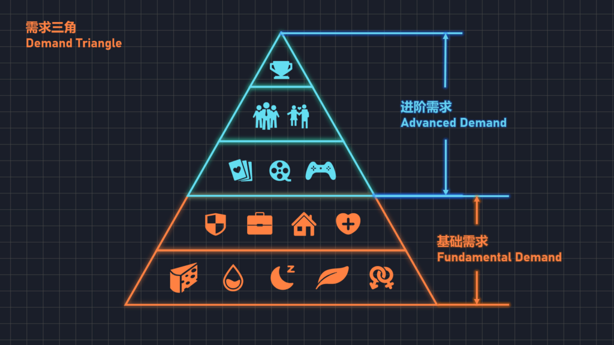](./img/image-1575703621406-1024x576.png)

## Strategy: From On-Demand to Trigger-Demand

An on-demand service answers a clear request: a user knows what they want, and the system delivers it. Fluxor extends this logic into a trigger-demand model. Instead of only responding to existing demand, the system brings unexpected services into a community and creates new reasons for people to gather, explore, learn, or collaborate.

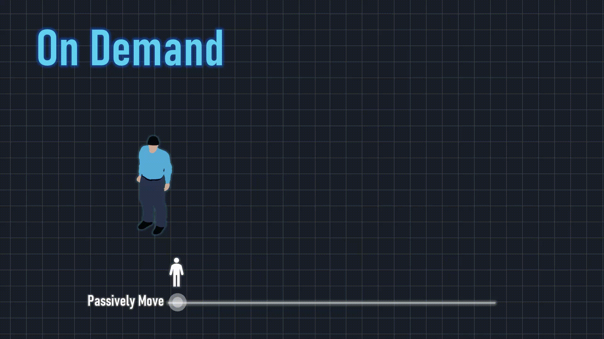

The Kano model helped frame this shift. Meeting expected needs prevents dissatisfaction, but it rarely creates surprise or attachment. Trigger-demand services can introduce moments that residents did not actively search for, yet may quickly recognize as valuable once they appear nearby.

[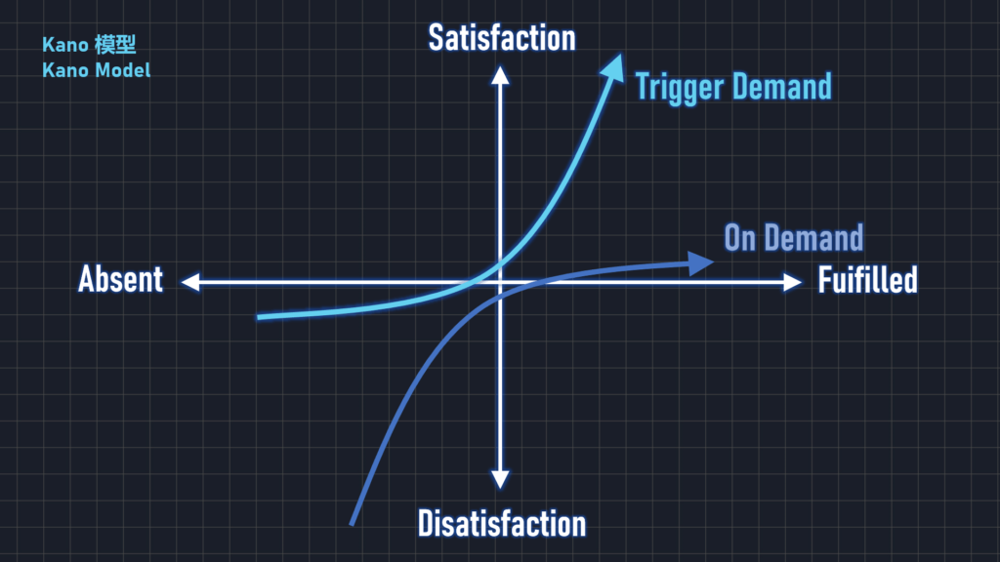](./img/image-1575708727310-1024x576.png)

## System Concept

Fluxor is a fleet of mobile service vehicles connected by an intelligent cloud system. Each vehicle carries a different service module and can move between neighborhoods according to time, demand, population density, and local events.

Rather than building every advanced service permanently in every suburb, Fluxor lets services flow through the region. The system can combine mobility, data, and modular interiors to create a flexible urban service network.

Four business and service modes were developed from the demand analysis: stores and manufacturers, public institutions, virtual service providers, and creative producers.

[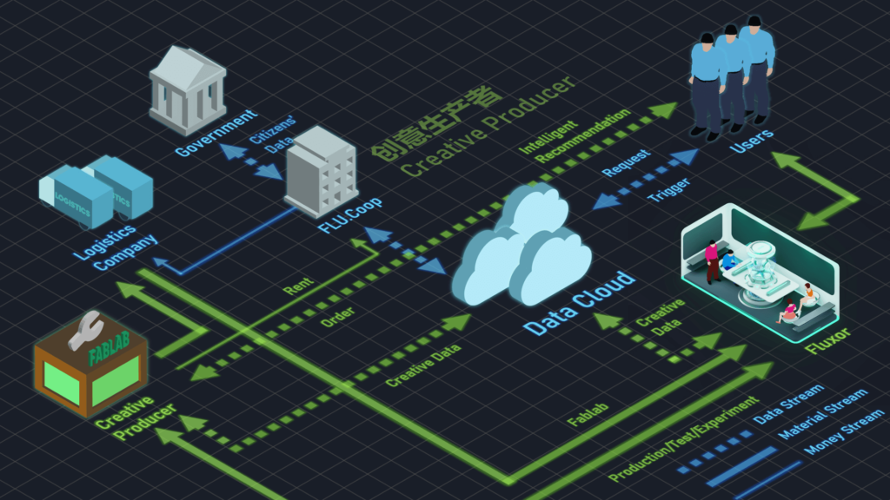](./img/Snipaste_2020-02-05_15-17-27-1024x576.png)

[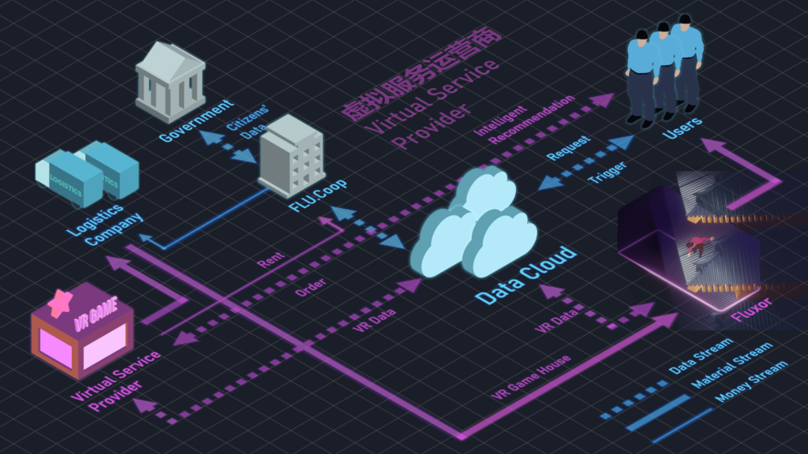](./img/Snipaste_2020-02-05_15-17-21-1024x576.png)

[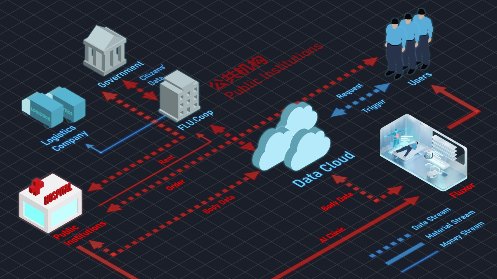](./img/Snipaste_2020-02-05_15-17-10-1536x864.jpg)

[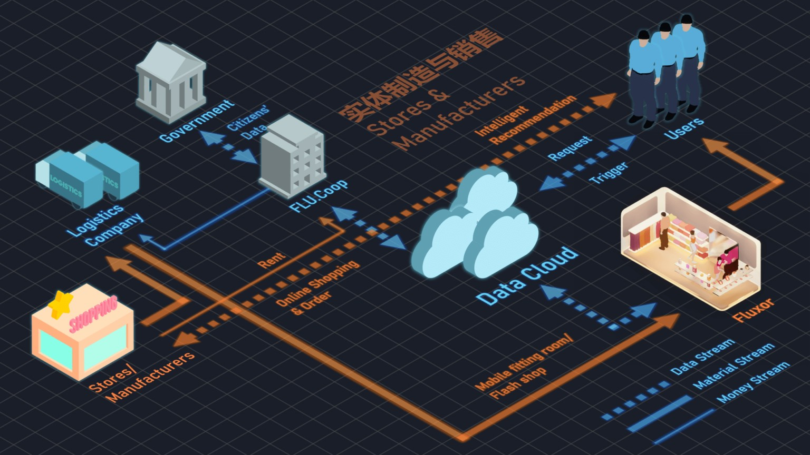](./img/Snipaste_2020-02-05_15-17-01-1536x864.jpg)

The exhibition prototype translated the system into a physical installation: a large touch table showed the regional service network and trigger-demand logic, while miniature vehicle modules demonstrated how services could change according to community needs.

<video src="/posts/fluxor/fluxor-exhibition-1.mp4" controls></video>

## Service Scenarios

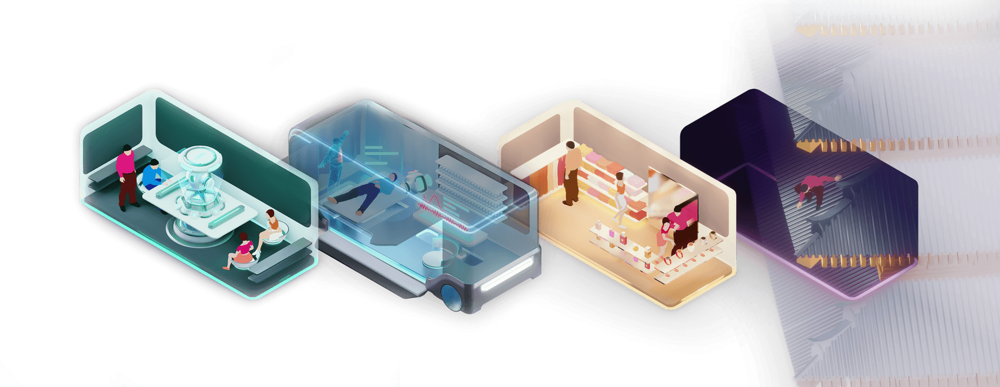

<video src="/posts/fluxor/fluxor-exhibition-2.mp4" controls></video>

### Mobile Flash Store

A Fluxor vehicle can bring curated products from different brands directly into a residential area. Instead of a static neighborhood shop, the service becomes a rotating local event where people discover clothing, accessories, perfume, or lifestyle goods near home.

### AI Clinic

A medical Fluxor can provide routine health checks with intelligent diagnostic equipment. Residents no longer need to travel to a central hospital for every minor examination, reducing both travel time and pressure on city-center medical resources.

### Multiplayer VR Gaming Room

Entertainment services can also become mobile. A VR gaming Fluxor creates a shared experience for young residents who may otherwise lack nearby leisure venues. The vehicle is not only a product delivery unit, but also a temporary social space.

### Co-Creation Laboratory

For people with ideas, tools, and professional skills, Fluxor can become a small co-creation lab. It gathers makers, designers, and local residents around collaborative production, giving suburban communities access to spaces for experimentation and self-actualization.

## Summary

Fluxor treats mobility as a way to reorganize urban opportunity. By moving advanced services through suburban communities, the system imagines a more distributed city where vitality is not locked inside the center, and where transportation becomes part of a larger social infrastructure.
