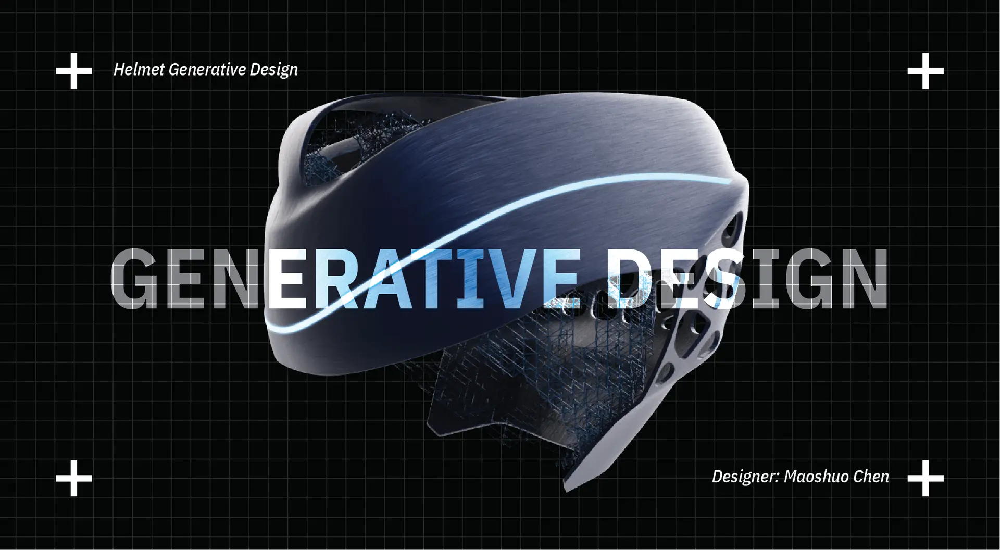

# Helmet Generative Design

Studies have shown that the impact of an accident on the head during riding comes from forces in the same direction (upper 45° angle). This generative helmet concept design is aimed at head protection, improvement of helmet lightweight, and heat dissipation. The generation step is divided into four steps. The first step summarizes the working conditions from the existing accident data and inspection standards. The second step uses the generative design module of Autodesk fusion 360 to generate the general shape. The third step is to use Grasshopper for dot matrix optimization. The fourth step is to use ANSYS to verify working conditions.

## Design Target

Traditional helmets often balance protection, weight, and ventilation through compromise. This concept uses generative structure to redistribute material: reinforcing high-risk impact areas, reducing redundant mass in lower-risk areas, and leaving space for airflow through the lattice structure.

<video src="/posts/helmet-generative/GenerativeHelmet.mp4" controls></video>

## Summary

Helmet Generative Design combines accident conditions, generative modeling, and structural validation to explore a cycling helmet that is lighter and more breathable while still responding to the most important impact directions.
