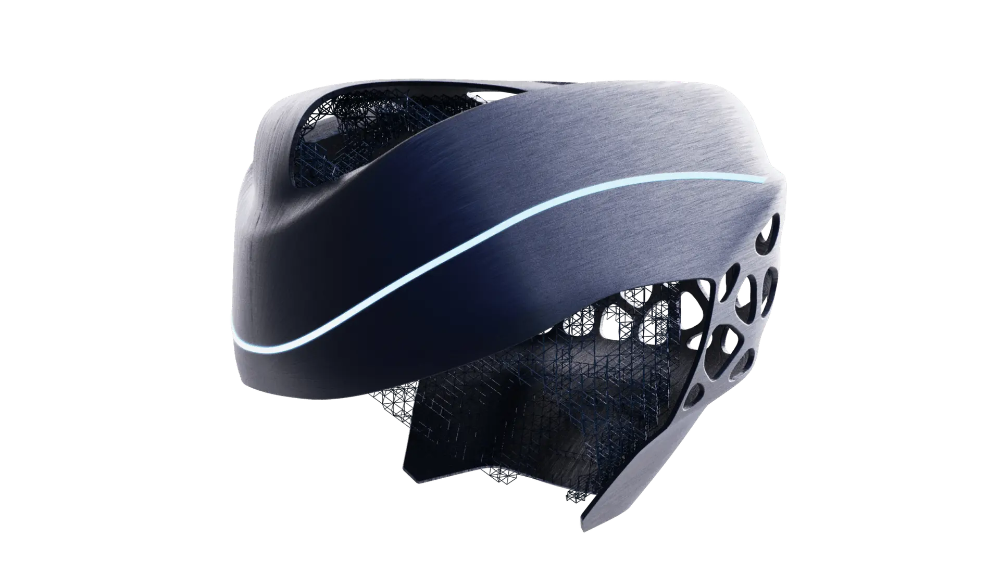

# Helmet Generative Design – 生成式骑行头盔概念

研究显示，骑行事故中头部受到的冲击往往来自相近方向，尤其是上方 45 度左右的角度。这个生成式头盔概念设计以头部保护为目标，同时关注轻量化和散热表现。

## 设计流程

生成过程分为四个步骤。首先，项目从已有事故数据和检测标准中总结头盔的主要工况。其次，使用 Autodesk Fusion 360 的生成式设计模块生成整体形态。第三步，通过 Grasshopper 对点阵结构进行优化。最后，使用 ANSYS 对工况进行验证。

## 目标

传统头盔常常在保护性能、重量和通风之间做取舍。这个概念尝试用生成式结构重新分配材料：在高风险区域加强保护，在低风险区域减少冗余材料，并通过点阵结构为散热留出空间。

设计流程从事故工况和安全标准出发，再进入生成式结构探索。Autodesk Fusion 360 用来生成主要支撑形态，Grasshopper 对点阵和局部密度进行优化，ANSYS 则用于验证选定冲击条件下的结构表现。

这套流程的目标不是为了得到复杂外观，而是让结构本身回答三个问题：哪里需要重点保护，哪里可以减少材料，以及通风孔隙如何和受力路径结合在同一套几何中。

<video src="/posts/helmet-generative/GenerativeHelmet.mp4" controls></video>

## 总结

Helmet Generative Design 将事故工况、生成式建模和结构验证结合起来，探索一种更轻、更透气，同时仍能回应关键冲击方向的骑行头盔设计。
