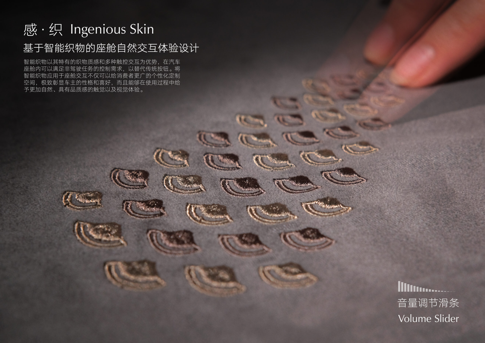
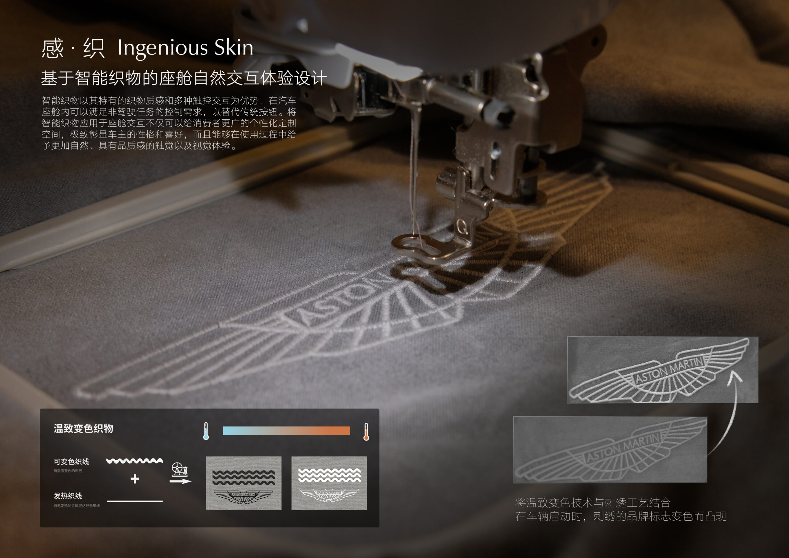
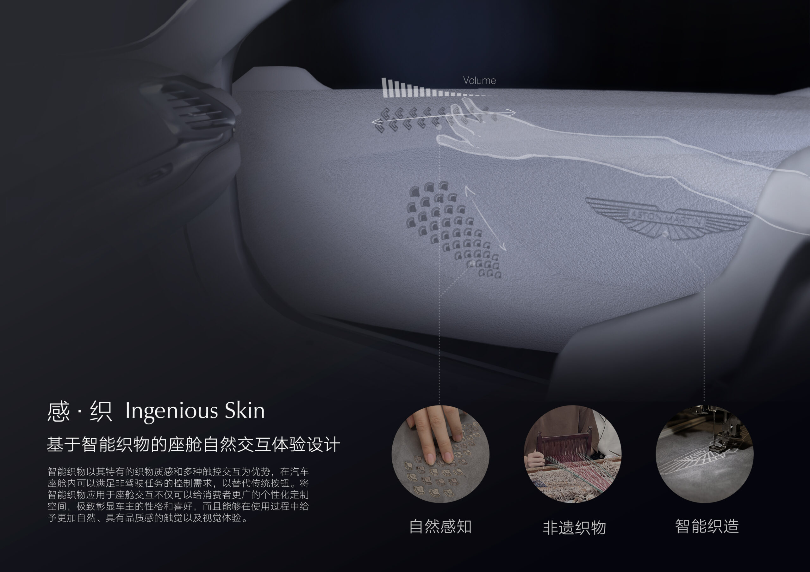
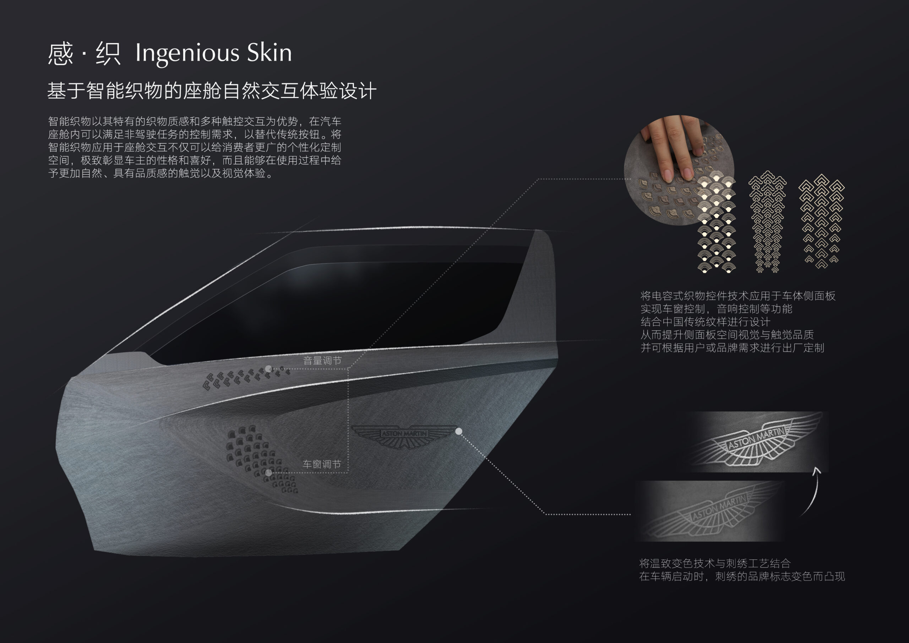
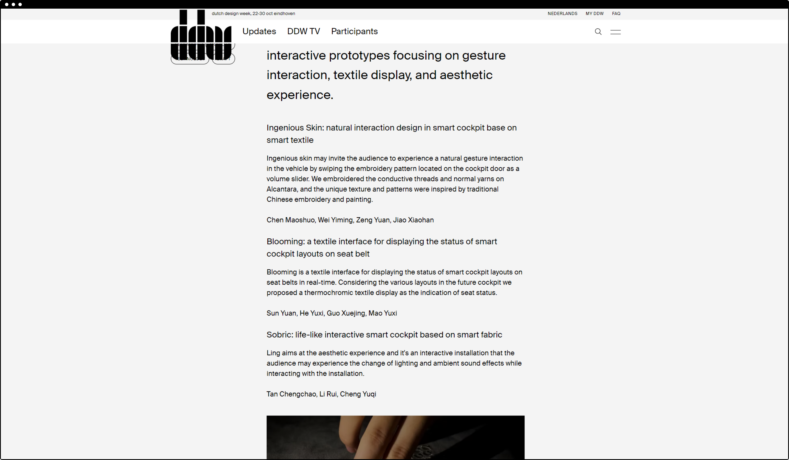

# Ingenious Skin – Natural Interaction Design in Smart Cockpit Based on Smart Textile

Ingenious Skin explores how smart textiles can make cockpit interaction feel more tactile, cultural, and intuitive. Instead of adding another screen or button to the vehicle interior, the project turns an embroidered door panel into an interactive surface. By swiping along the conductive embroidery pattern, the user can adjust the audio volume through a gesture that feels closer to touching fabric than operating a device.

## Concept

The project combines conductive thread, traditional yarn, and Alcantara to build a textile interface that is both functional and decorative. The pattern language is inspired by Chinese embroidery and painting, allowing the interaction layer to become part of the visual identity of the cockpit rather than a hidden technical component.

This approach gives the smart cockpit a softer interaction vocabulary. The door trim is no longer only a material surface; it becomes a subtle input area that can sense touch, invite gestures, and connect digital control with craft.

## Design

## Exhibition

The work was exhibited at Dutch Design Week 2021 as part of the project "Embroidering the Next Mobility."

[https://ddw.nl/en/programme/5738/embroidering-the-next-mobility](https://ddw.nl/en/programme/5738/embroidering-the-next-mobility)

## Summary

Ingenious Skin reframes vehicle interaction as an extension of material experience. It suggests that future cockpits do not have to become more screen-heavy; they can become more sensitive, more crafted, and more natural to touch.
