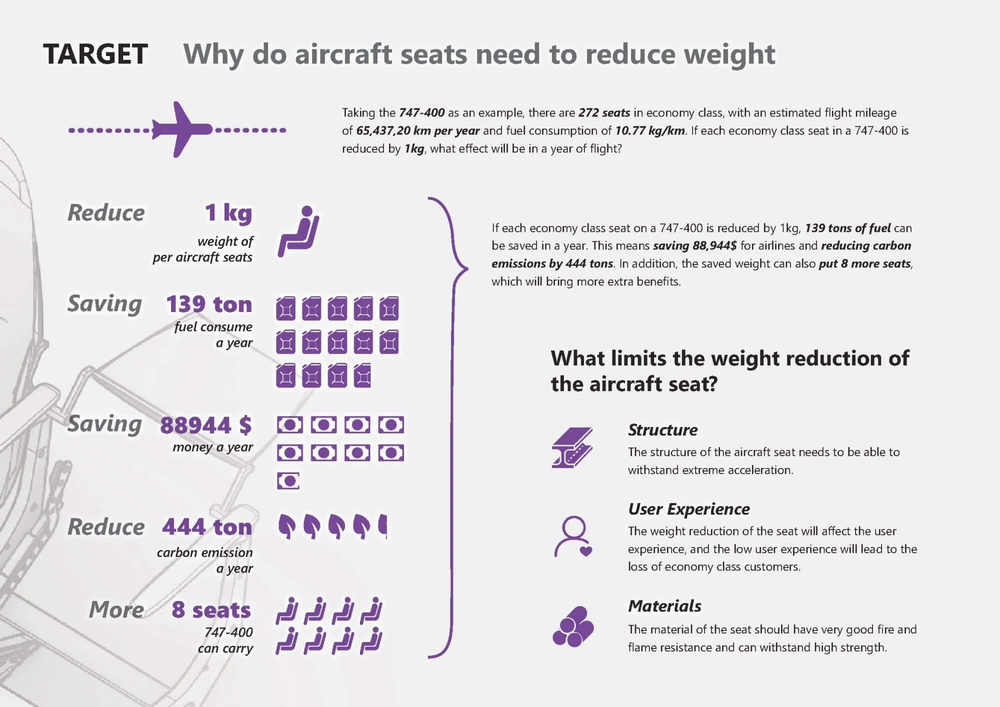
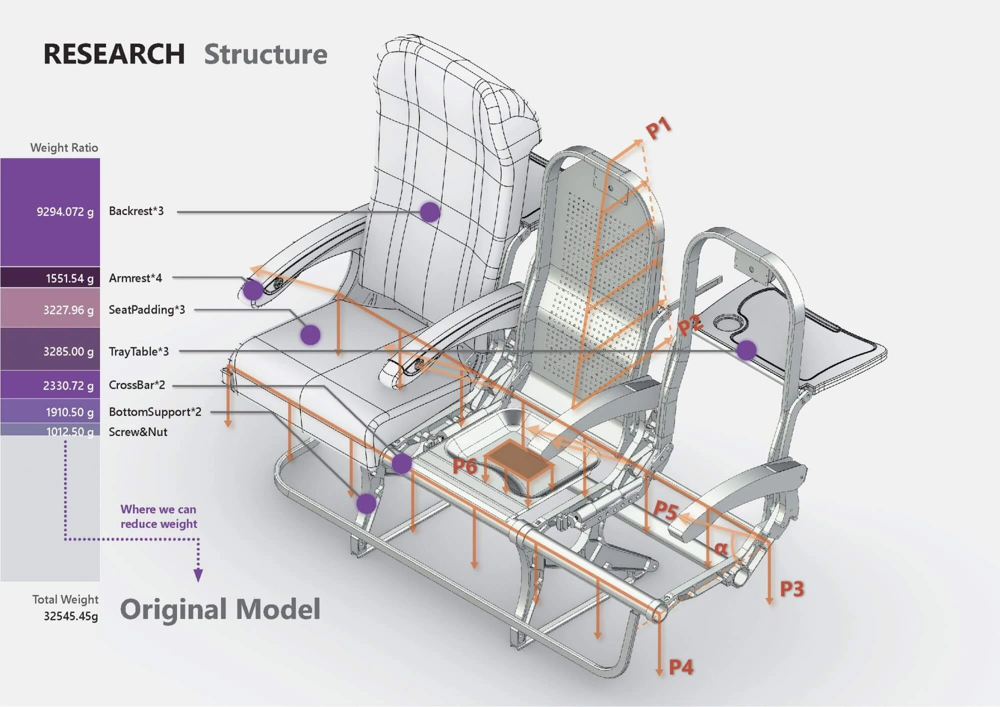
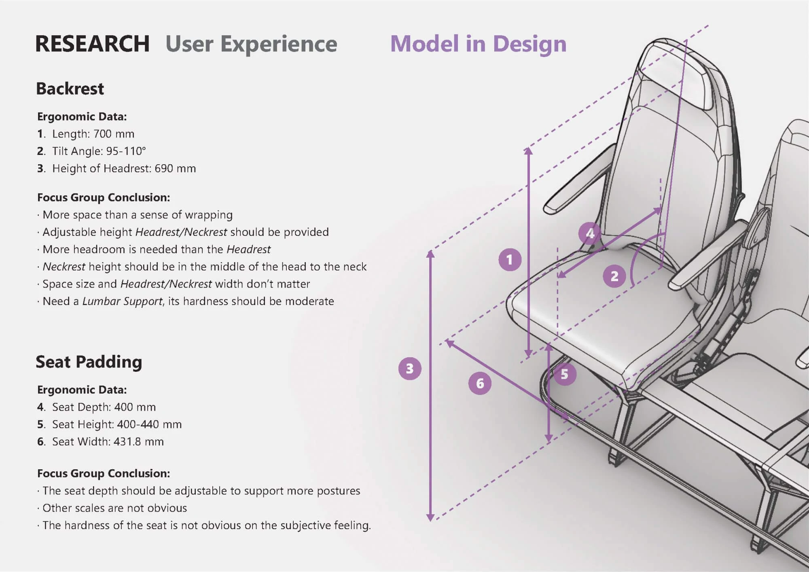
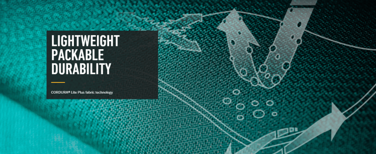
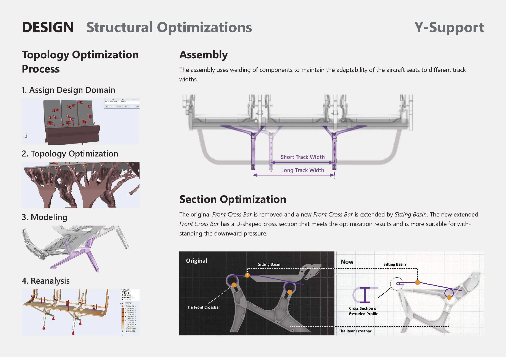
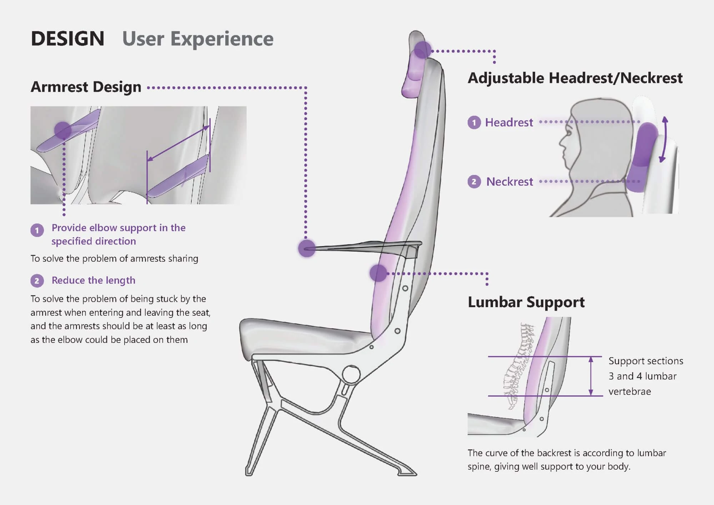
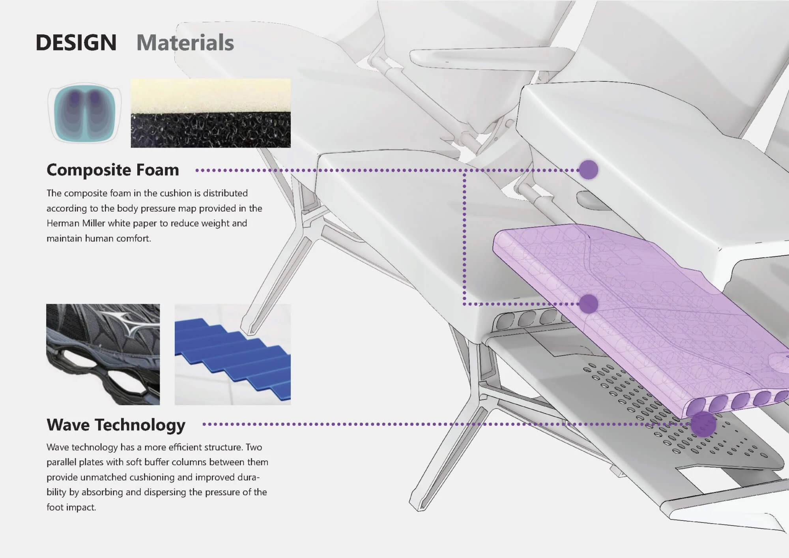

# Minimalism – Aircraft Seat Lightweight Design

Minimalism is a lightweight aircraft seat concept that balances three factors: **structure**, **materials**, and **user experience**. The project explores how to reduce seat weight without treating comfort, safety, and manufacturability as afterthoughts.

<video src="/posts/minimalism/img/AircraftSeats.mp4"></video>

## 🎯 Target: Why Aircraft Seats Need to Lose Weight

Taking the Boeing 747-400 as an example, an economy cabin has 272 seats. Based on an estimated annual flight distance of 6,543,720 km and fuel consumption of 10.77 kg per km, even a small reduction in the weight of each seat can create a meaningful operational impact.

If each economy class seat on a 747-400 is reduced by 1 kg:

⛽ **139 tons of fuel** can be saved in a year.  
💵 **$88,944** can be saved for the airline.  
🏭 **444 tons of carbon emissions** can be reduced.  
💺 **8 additional seats** can be added to a 747-400.

For airlines, seat weight is connected to fuel cost, capacity, and carbon emissions. For passengers, however, weight reduction cannot come at the expense of comfort or safety. This project therefore treats lightweight design as a balance between engineering and experience.

## 📚 Research: What Limits Aircraft Seat Weight Reduction

### 🔧 Structure

_Aircraft seat structures must withstand extreme acceleration and forces from multiple directions._

For structural research, we collected the weight data of the original aircraft seat model and studied the Chinese national safety standard for aircraft seats, SAE AS 8049B. With support from civil and mechanical engineering students, we analyzed weight distribution and force paths to identify which parts of the structure had potential for weight reduction.

Aircraft seat weight and force analysis diagram.

### 👨 User Experience

_Reducing seat weight can affect comfort, and poor comfort may directly influence the passenger experience in economy class._

From ergonomics and user needs, we studied aircraft seat dimensions and conducted focus group interviews with passengers. The research helped define which areas of the seat should remain supportive, which areas could be reshaped, and where material changes might affect the perception of comfort.

Aircraft seat ergonomics data and focus group conclusions.

### 🧱 Materials

_Seat materials must meet strict requirements for strength, durability, and fire resistance._

Material selection was also constrained by the safety standard. Based on these requirements, we explored lightweight materials from companies such as DuPont and considered how new materials could work together with a metal frame. The goal was not to replace every structural part, but to use materials more precisely where they could reduce weight without weakening the seat.

## 🎨 Design: How to Reduce the Weight of the Seat

### 💺 Appearance

<iframe style="width: 100%; aspect-ratio: 16/12;" src="/posts/minimalism/xr/ModelD0611_XR.46.html" frameborder="0">
</iframe>

### 🔧 Structure

**Y-shaped chair legs**

The leg structure is guided by topology optimization. Two forked trusses provide more direct support for the seat pan, reducing unnecessary material while keeping the force path clear.

**Front beam cross-section optimization**

The front beam uses a bent sheet-metal structure with an extended scale and a longitudinal welded plate. This creates an I-shaped cross-section that improves bending resistance and distributes stress more evenly across the seat pan.

**Y-shaped mesh inside the backrest**

The backrest frame borrows from the structure of a badminton racket. Its internal curved sections spread impact forces across the frame, reducing local stress concentration.

### 👨 User Experience

The armrest shape subtly separates the personal space of passengers on both sides. The area of the backrest near the spine follows the body curve more closely, providing better support while maintaining a lighter visual language.

### 🧱 Materials

The cushion and backrest use a composite foam structure with density distributed according to sitting pressure. Inspired by sneaker midsoles, wavy sections help disperse pressure and reduce material use where full density is not needed.

## 💡 Design Outcome

Minimalism reduces weight through structural clarity, material precision, and comfort-aware detailing. The final concept does not rely on a single lightweight trick. Instead, it combines optimized load paths, selective material use, and ergonomic support to create an aircraft seat that is lighter while still responding to the safety and experience requirements of aviation design.
