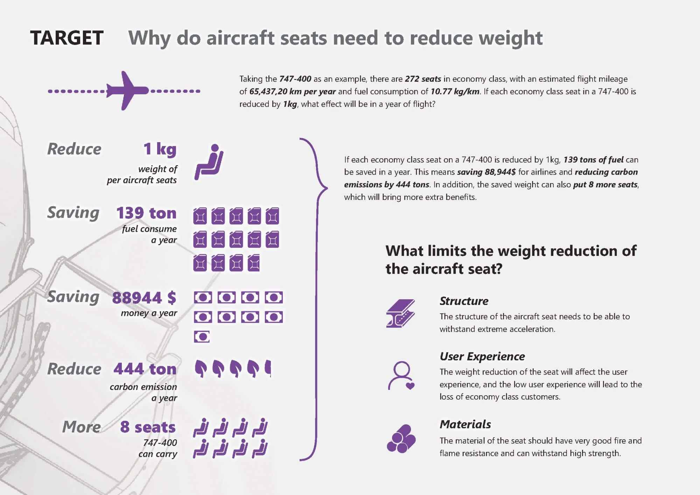
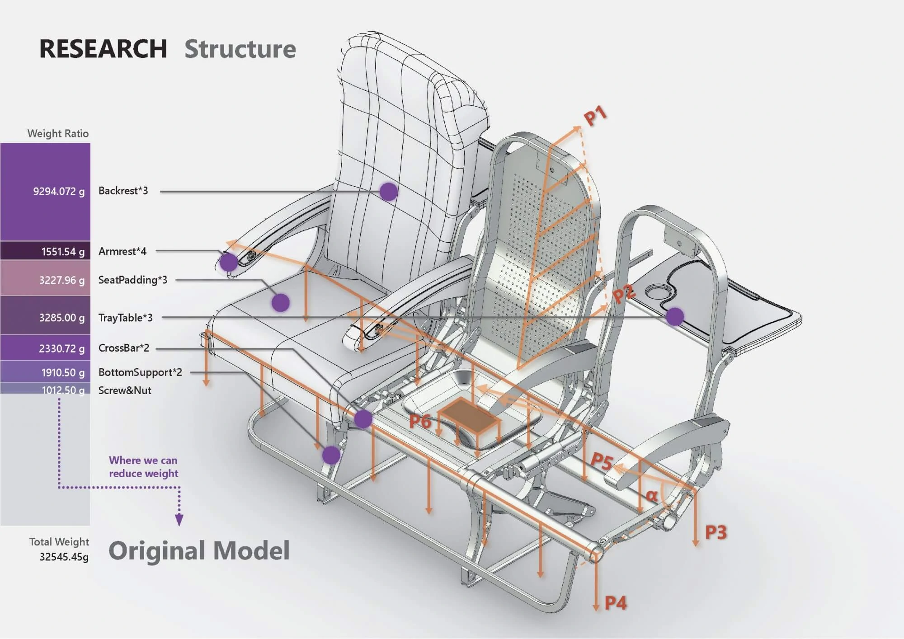
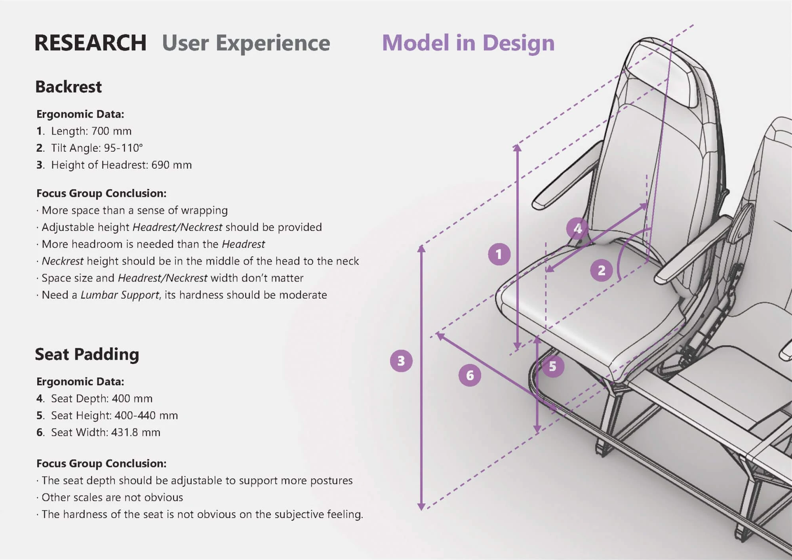
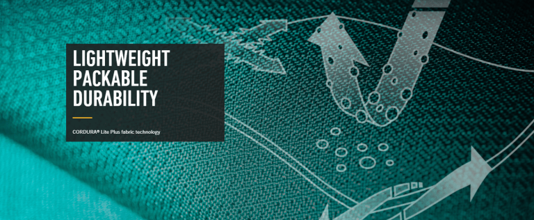
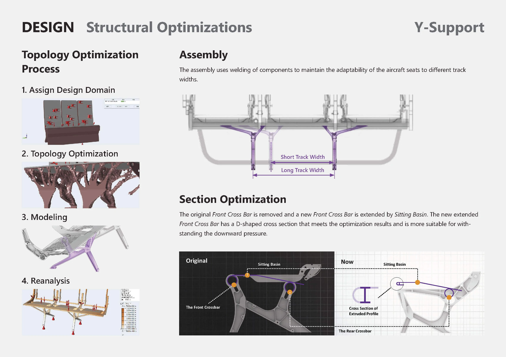
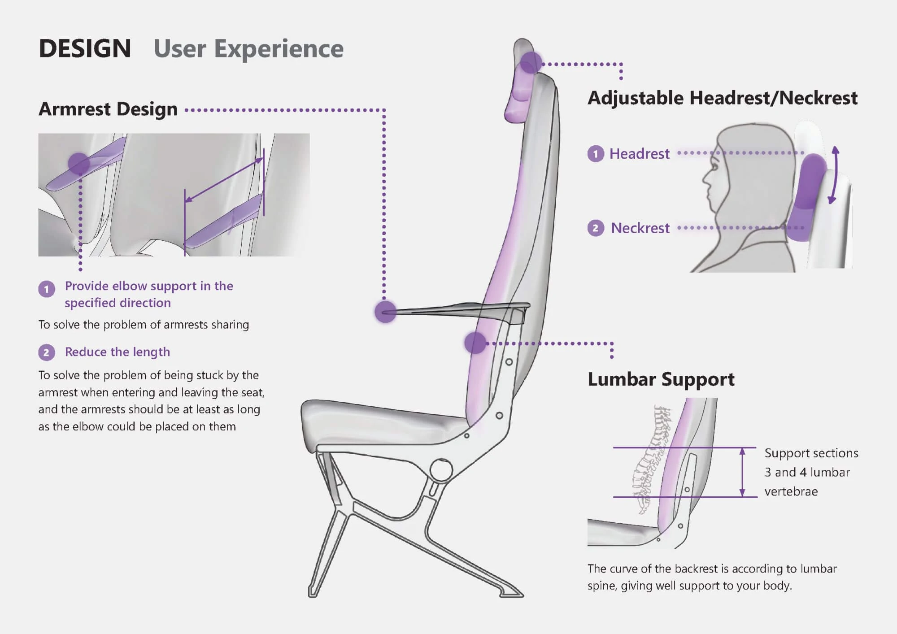
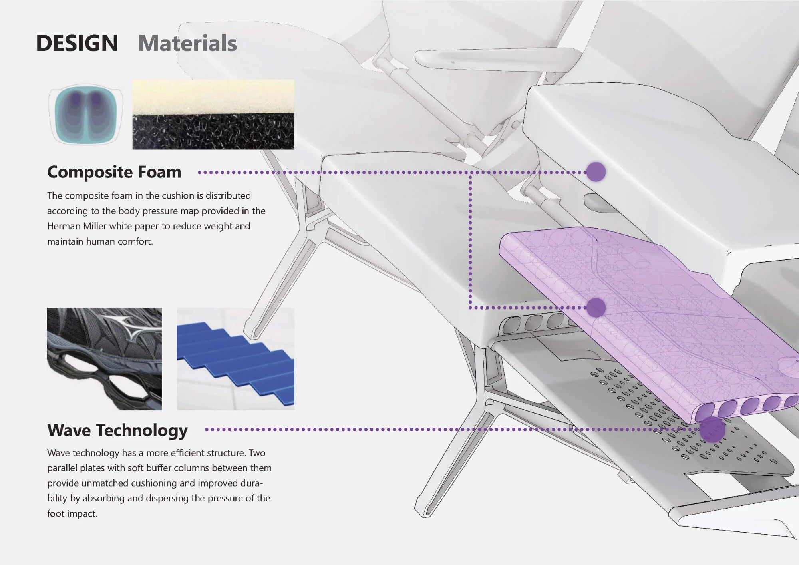

# Minimalism – 飞机座椅轻量化设计

Minimalism 是基于平衡**结构**、**材料**和**用户体验**三个因素的飞机座椅轻量化设计。

<video src="/posts/minimalism/img/AircraftSeats.mp4"></video>

## 🎯 目标：为什么飞机座椅需要减重？

---

以✈️波音 747 为例，经济舱有💺272 个座位，估计每年飞行里程为⛽65,437,20 公里，每公里油耗为 10.77 公斤。

如果 747-400 上的每个经济舱座位减少 1 公斤，  
⛽ 一年可节省**139 吨燃料**  
💵 可为航空公司节省**88,944 美元**  
🏭 可减少**444 吨碳排放**  
💺 一架 747-400 可**增加 8 个座位**  
如果节省这些重量，将带来更多额外收益。

无论是从环保角度还是从航空公司的商业利益来看，减轻飞机座椅的重量都非常重要。

## 📚 研究：什么限制了飞机座椅的减重

---

### 🔧 结构

_飞机座椅的结构需要能够承受来自各个方向的极端加速度。_

对于飞机座椅的结构，我们获取了飞机座椅（原始模型）的重量数据和中国飞机座椅国家安全标准（SAE AS 8049B）。在土木和机械工程专业学生的帮助下，以下图表展示了数据分析结果（重量和力）。彩色部分显示我们可以减轻飞机座椅的重量。

飞机座椅（原始模型）重量与受力分析图

### 👨 用户体验

_座椅的减重会影响用户体验，而低用户体验会导致经济舱客户流失。_

从人机工程学和用户需求的角度，我们对飞机座椅进行了人体工学尺度研究，并对飞机乘客进行了焦点小组访谈。以下是用户体验研究的一些结果。

飞机座椅人体工学数据与焦点小组结论

### 🧱 材料

_座椅材料需要具有非常好的防火阻燃性能，并能承受高强度。_

在材料方面，中国飞机座椅国家安全标准（SAE AS 8049B）也有规定。在标准基础上，从轻量化的角度寻找杜邦等公司的新材料。我们还考虑了金属框架与新材料结合的可能性。

## 🎨 设计：如何减轻飞机座椅的重量？

---

### 💺 外观

<iframe style="width: 100%; aspect-ratio: 16/12;" src="/posts/minimalism/xr/ModelD0611_XR.46.html" frameborder="0">
</iframe>

### 🔧 结构

**Y 形椅腿**

从拓扑优化形式获得指导，使用两个叉形桁架为盆体提供更直接的支撑。

**前梁截面结构优化：**

钣金弯曲通过向前延伸刻度并插入纵向焊接板来实现。这样创造出整体更耐弯曲的 I 形截面结构，并使盆体中的应力分布更加均匀。

**靠背内部结构采用 Y 形网状分布：**

我们使用羽毛球拍的结构作为框架部分。框架的横截面使用内部曲面将冲击力分散到整个框架。

### 👨 用户体验

扶手的形状暗示性地划分了两侧用户的区域，靠背靠近脊柱的部分贴近身体曲线，提供更好的支撑。

### 🧱 材料

坐垫和靠背采用复合海绵结构，根据坐姿压力进行密度分布。受运动鞋启发，使用波浪形截面来分散压力。

