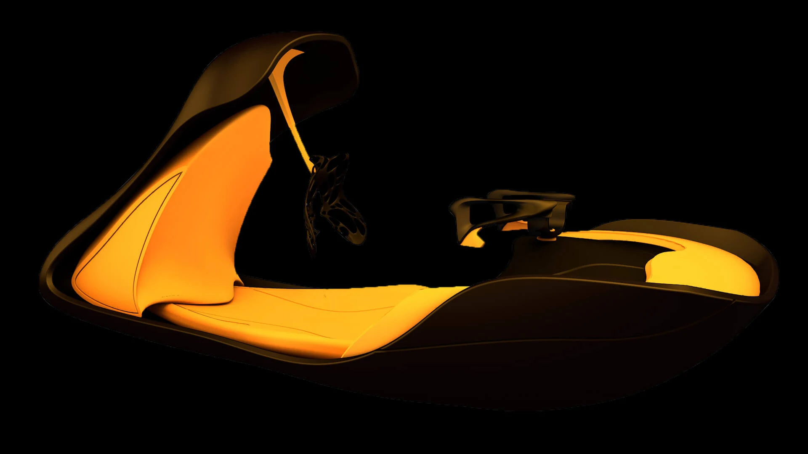
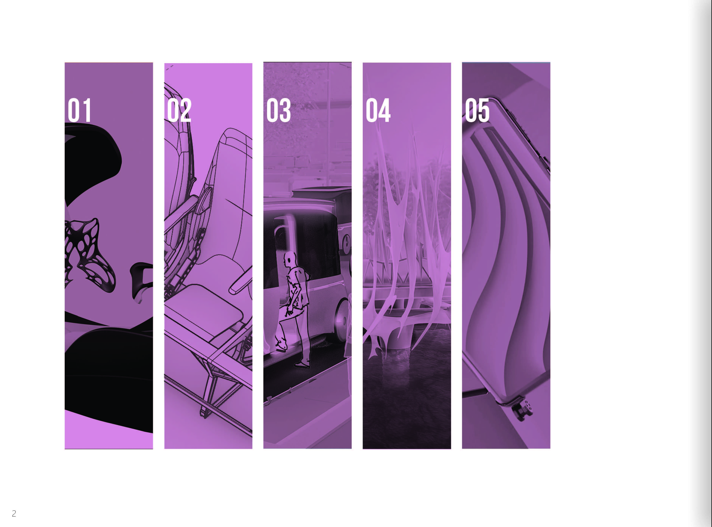
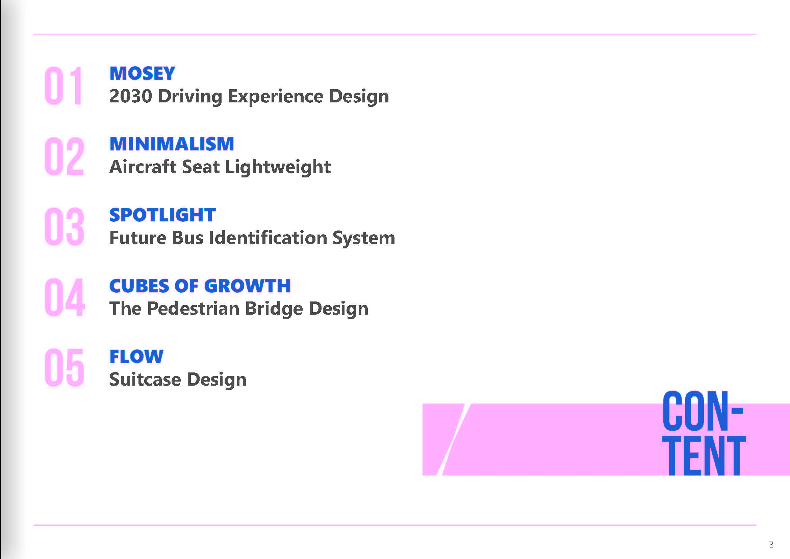
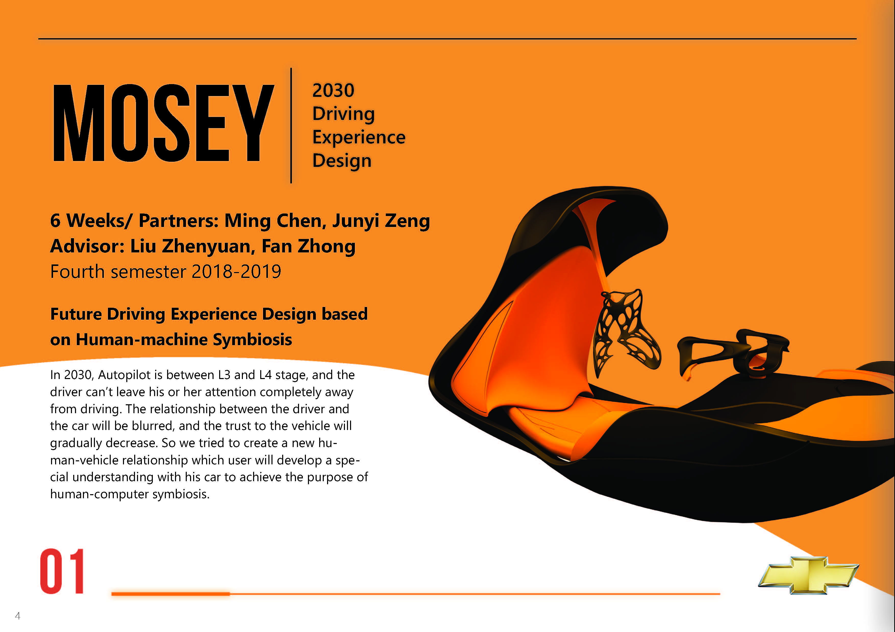
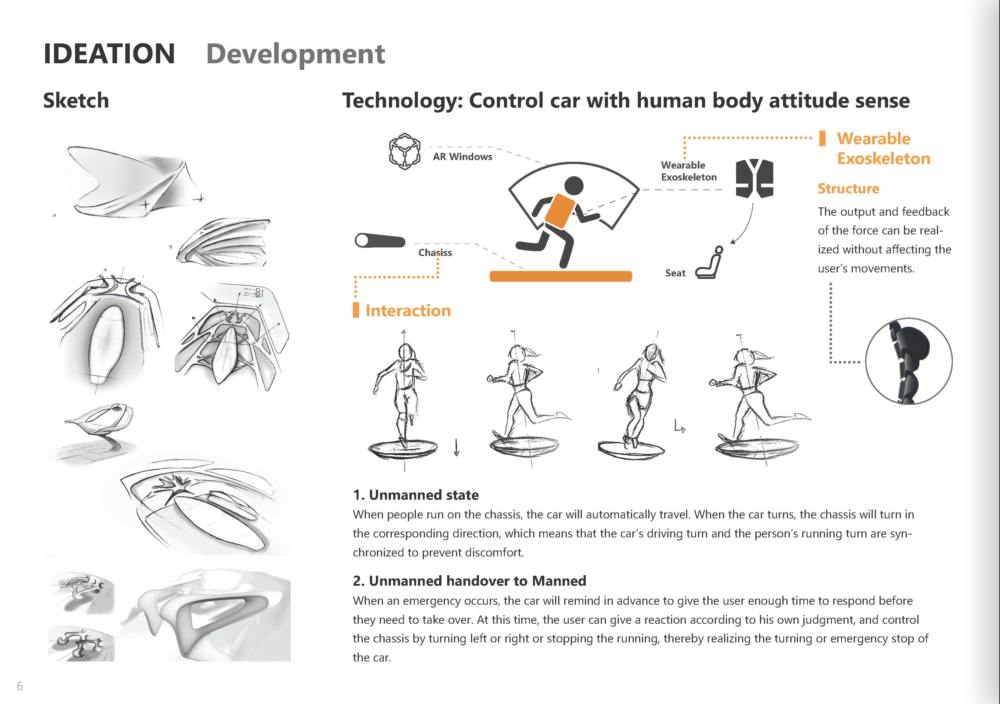
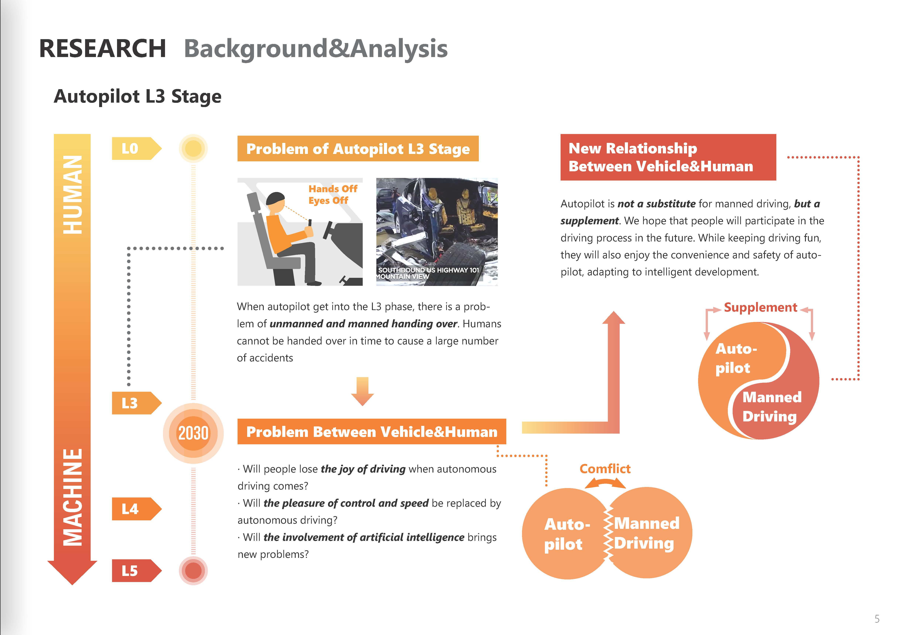

# MOSEY – 2030 未来驾驶体验设计

**_MOSEY 是一个基于人机共生关系的未来驾驶体验设计。_**

在 2030 年，自动驾驶可能处在 L3 到 L4 的过渡阶段。车辆能够承担更多驾驶任务，但驾驶者仍然不能完全脱离驾驶情境。这个阶段会带来新的问题：人类控制和机器控制之间的边界变得模糊，当驾驶者无法理解车辆正在做什么、为什么这样做时，对车辆的信任也会逐渐下降。

MOSEY 探索的是这种过渡阶段中更温和的人车关系。它不把汽车视为一个被动工具，也不把它视为完全独立的机器，而是把车辆想象成一个能够表达状态、意图和能力边界的协作伙伴。

<video src="/posts/mosey/Mosey_x264.mp4" controls></video>

## 研究：L3 自动驾驶的交接问题

当自动驾驶进入 L3 阶段，系统可以在特定条件下驾驶，但当系统到达能力边界时，车内的人仍然需要接管。这就形成了关键的交接问题：如果车辆提醒太晚，或者驾驶者无法快速理解当前情况，从机器控制切换到人工控制就可能变得危险。

因此，这个项目没有把自动驾驶理解为对人工驾驶的完全替代，而是把它视为一种补充。项目关注的问题是：未来驾驶能否在保留控制乐趣的同时，提供自动驾驶带来的便利和安全。

## 设计方向：人机共生

MOSEY 基于三层用户诉求建立新的人车关系：

- **可知性**：驾驶者应该理解车辆的状态、意图、路线、风险等级和即将发生的决策。
- **可控性**：当系统需要人的判断时，驾驶者应该有明确、自然的参与方式。
- **可预测性**：车辆行为需要足够一致，让长期使用中的信任逐渐建立。

最终概念结合了 AR 车窗、可响应的座椅底盘和可穿戴外骨骼。它们共同把驾驶者的身体姿态转化为输入方式，并让车辆的意图在行动发生前变得可见。

## 交互概念

### 转向交互

当车辆即将转向时，AR 车窗会提前提醒驾驶者。驾驶者可以在座椅底盘上向左或向右倾斜，车辆随之完成对应转向。座椅底盘的运动让身体与车辆动作同步，减少不适感，也让驾驶者保持参与感。

### 停车交互

当车辆检测到系统无法独自处理的危险情况时，会提前提醒驾驶者。驾驶者可以做出紧急停车姿态，车辆随之停止。这种交互为高压场景提供了一种简单的身体化响应方式，避免传统控制方式反应过慢。

## 自适应外骨骼

外骨骼被设计为驾驶者和车辆之间的有机界面。通过长期使用，它会逐渐适应驾驶者的身体和驾驶习惯。概念中设想外骨骼内部布置微型 3D 打印头，通过生长模拟算法让结构逐步变得更加个人化。

## 总结

MOSEY 把未来驾驶体验视为一种关系设计问题。随着自动化程度提高，关键不只是系统有多强，而是它能否清晰地与车内的人共享责任。项目以可知性、可控性和可预测性作为基础，提出一种更容易理解的人机协作方式。
