# PaperClip – 面向学术研究的纸质知识管理工具

PaperClip 是一款面向**学术研究者**的_**文献知识管理工具**_，帮助他们从阅读和笔记中挖掘有价值的知识，辅助思考和分析，支持选题等研究过程。其心智模型是齐特尔卡斯特卡片盒笔记法，知识图谱技术为其功能提供支持。

<video src="/posts/paperclip/img/paperclip.mp4"></video>

## 💻 原型演示

---

**[👉 点击链接全屏探索原型！](/posts/paperclip/paperclip-prototype/index.html#id=aulfuv&p=subs&sc=2&c=1)**

<iframe style="aspect-ratio: 16/9;" src="/posts/paperclip/paperclip-prototype/index.html#id=aulfuv&amp;p=subs&amp;sc=2&amp;c=1" onload="this.style.display='block'" width="100%" frameborder="0">
</iframe>

## 📚 研究背景

---

在研究过程中，研究者需要处理大量的文献知识并进行探索发现。知识图谱技术可以将互联网和学术文献中的知识转化为更适合人类认知和机器处理的数据格式。因此，我尝试将知识图谱技术应用于交互设计，以辅助文献研究的知识管理。

### 👨‍🎓 用户研究 – 学术研究者

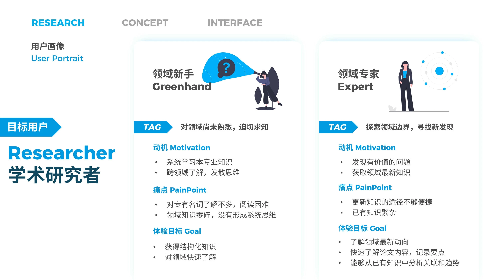
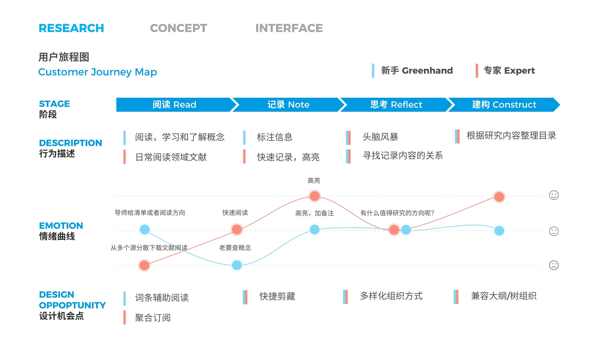

### 🔍 技术研究 – 知识图谱

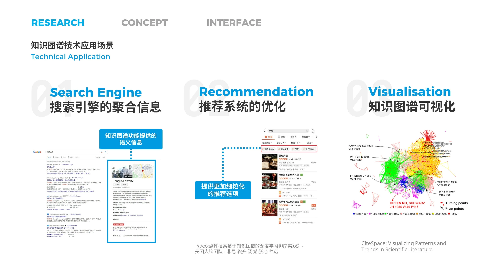
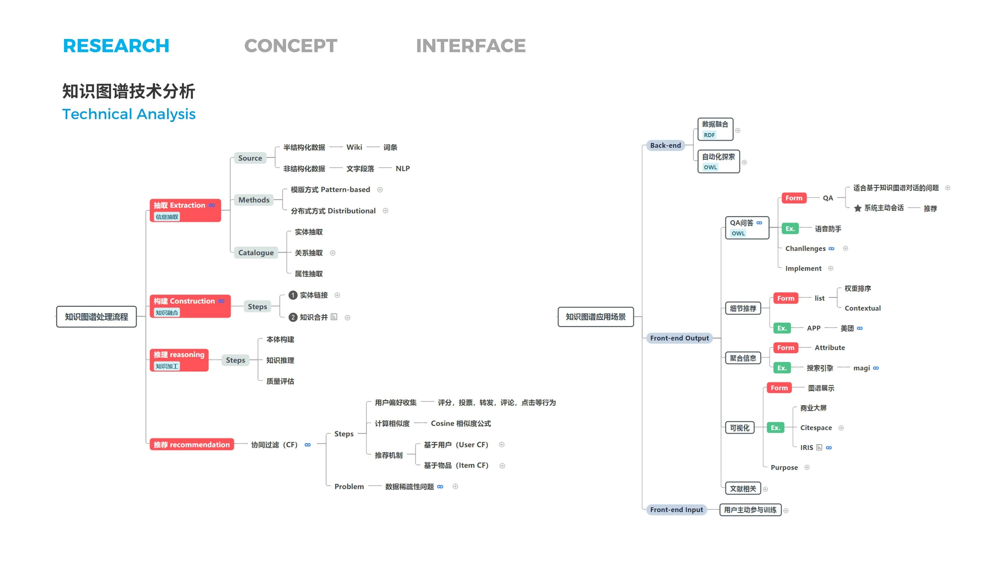

### 📖 竞品分析 – 知识管理工具

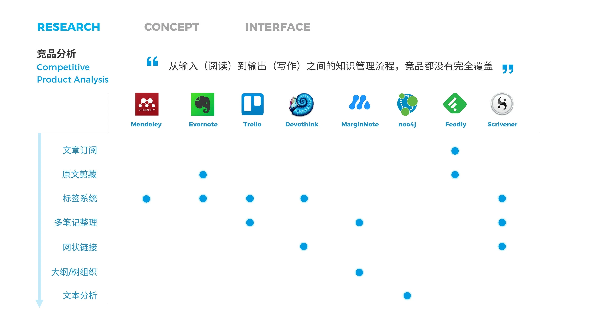

## 🎯 概念设计

---

### 🔨 产品框架

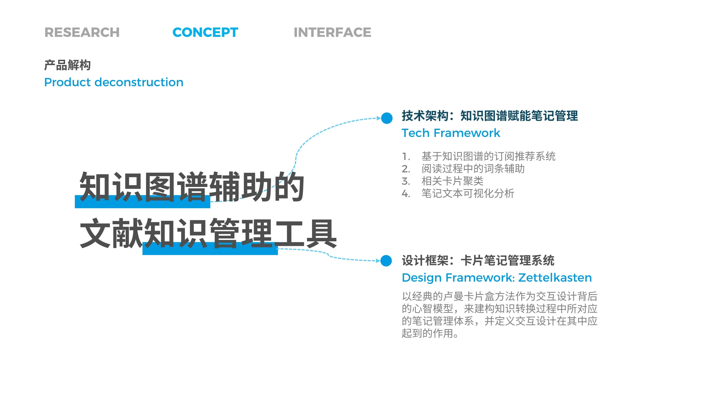
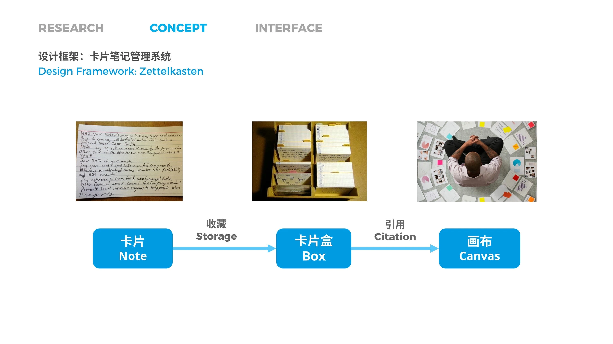
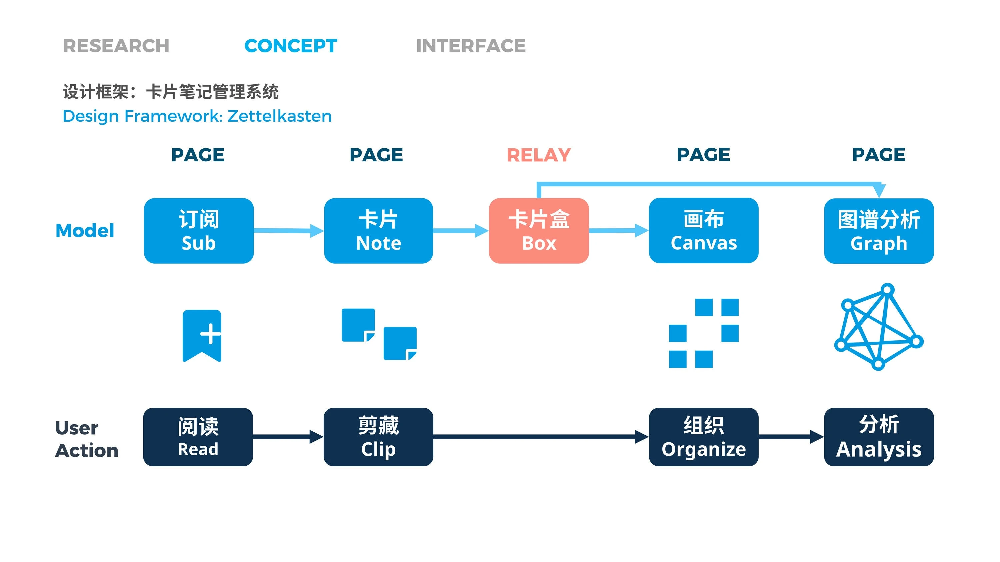

### 🔩 功能定义

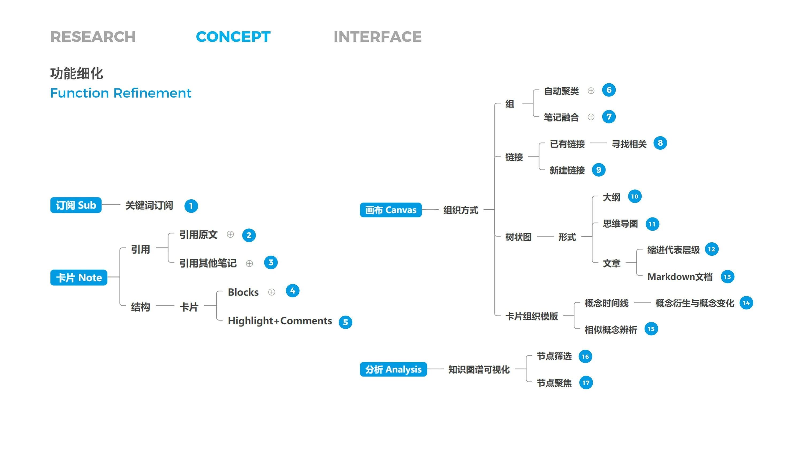
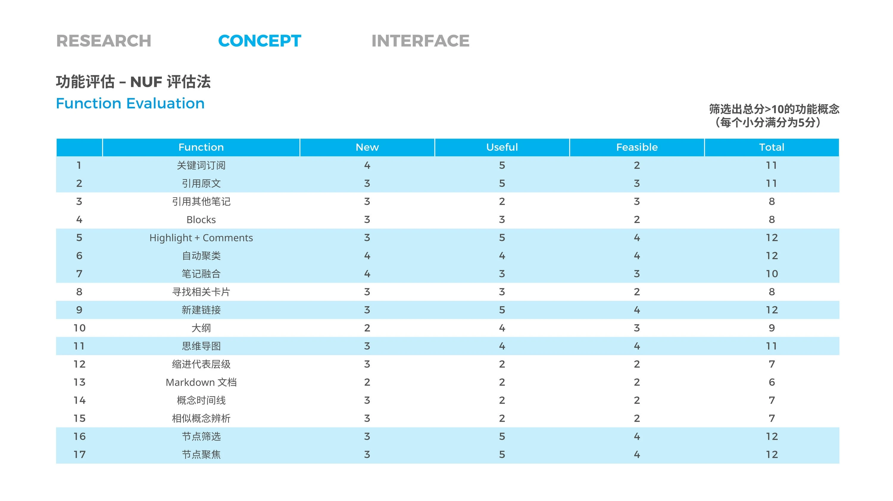

### 🔍 技术框架

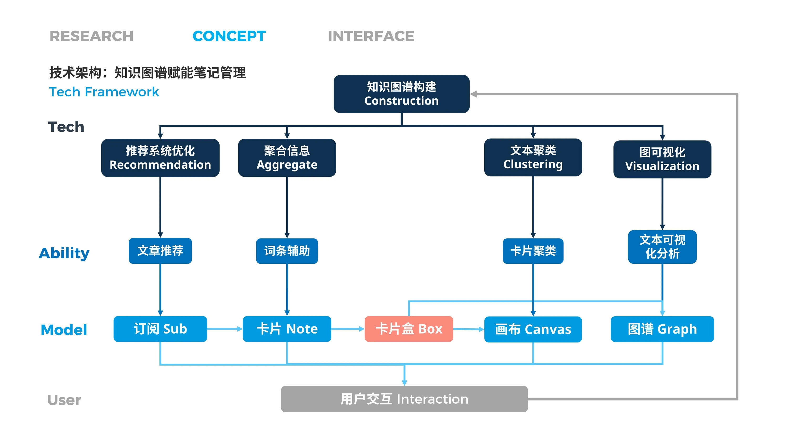

## 🎨 设计详情

---

**订阅**：轻松通过关键词、作者或出版物订阅你感兴趣的论文，满足日常阅读需求！

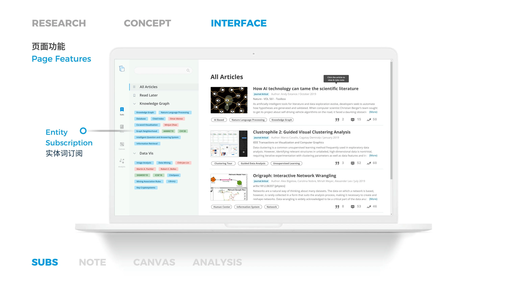

**笔记**：在这里你可以轻松高亮文章并添加评论，这些内容将以卡片形式存储在卡片盒中。还有辅助阅读的条目功能。

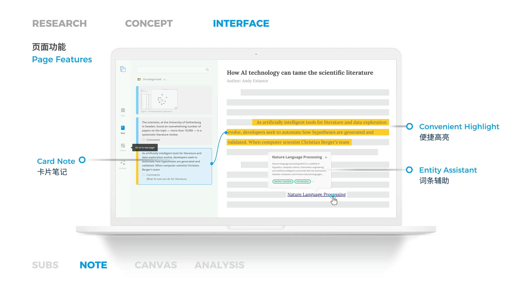

**画布**：在画布上自由轻松地组织卡片。你可以使用分组、链接和树状图来组织和思考它们之间的关系。

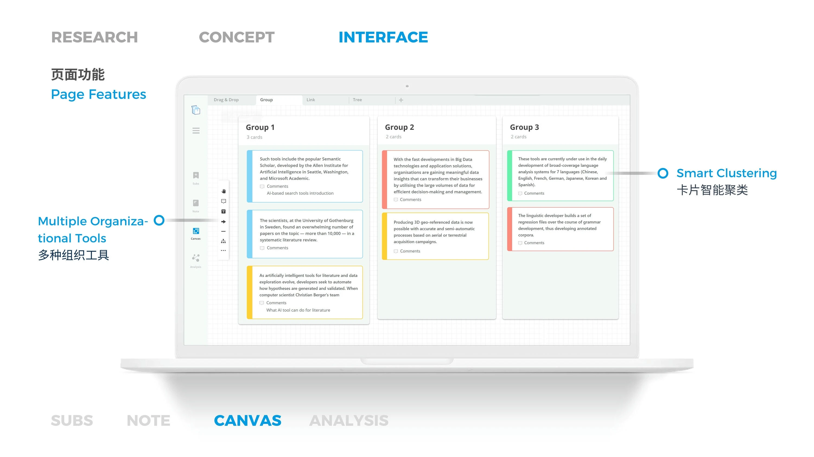

**分析**：在这里你可以选择想要分析的卡片，生成可视化的知识图谱。不仅可以分析卡片中提到的概念关系，还可以分析它们链接的论文信息。

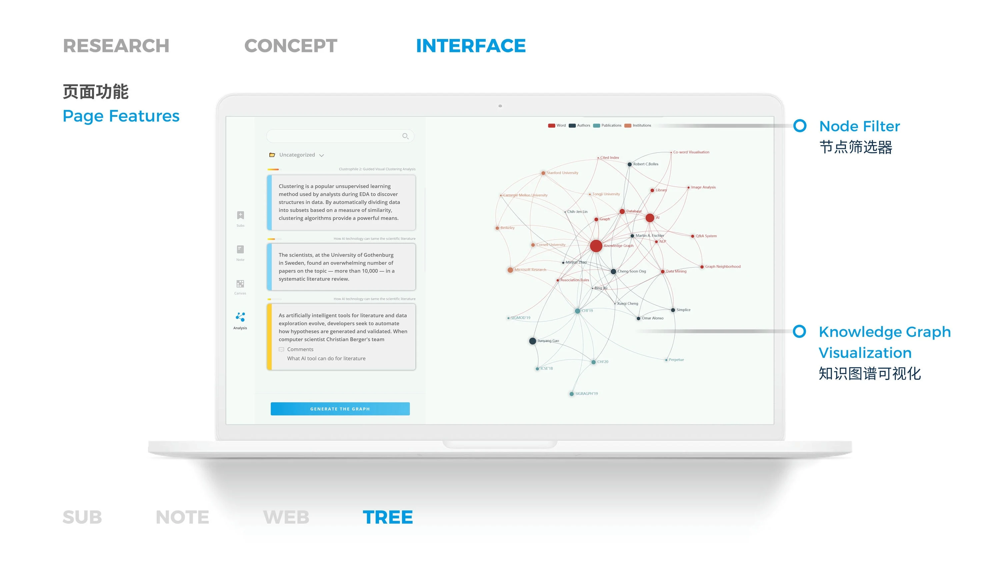

如果你想了解更多关于这个项目的细节，可以观看下面的详细介绍视频（中文）。
