# PaperClip – 面向学术研究的文献知识管理工具

PaperClip 是一款面向**学术研究者**的文献知识管理工具。它帮助研究者把论文、划线、笔记和概念关系组织成一个连续的研究工作台，让阅读不只是资料存储，而是逐渐转化为可连接、可分析、可用于选题和论证的知识网络。产品的心智模型来自齐特尔卡斯特卡片盒笔记法，并用知识图谱技术支持关系分析。

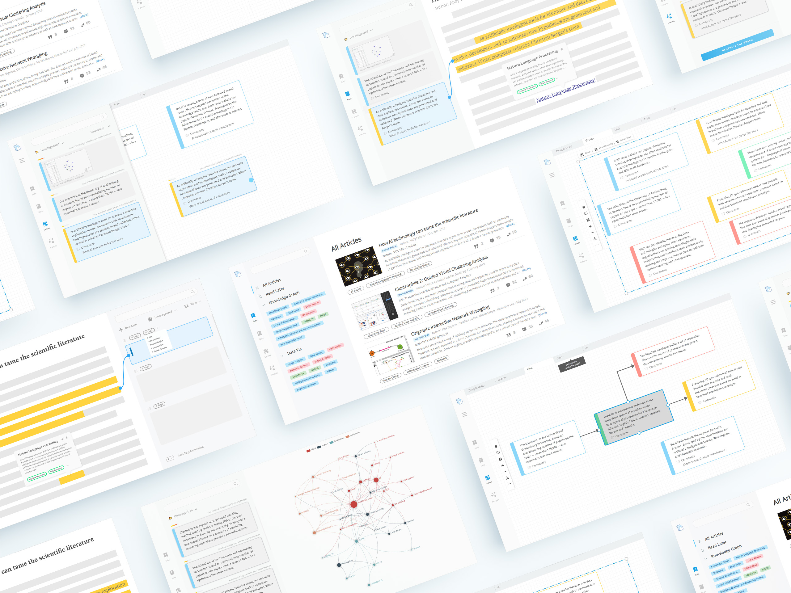

<video src="/posts/paperclip/img/paperclip.mp4" controls></video>

## 💻 原型演示

**[👉 点击链接全屏探索原型](/posts/paperclip/paperclip-prototype/index.html#id=aulfuv&p=subs&sc=2&c=1)**

<iframe style="aspect-ratio: 16/9;" src="/posts/paperclip/paperclip-prototype/index.html#id=aulfuv&amp;p=subs&amp;sc=2&amp;c=1" onload="this.style.display='block'" width="100%" frameborder="0">
</iframe>

下面的视频完整讲解了项目逻辑，从研究背景、系统框架到原型工作流都有覆盖。

<video src="/posts/paperclip/img/paperclip_presentation.mp4" controls></video>

## 📚 研究背景：为什么文献知识难以管理

学术研究并不是线性的。研究者需要从不同渠道收集论文，在不同时间和深度下阅读它们，持续记录笔记，并在之后把分散的知识片段重新组织成研究问题、论证结构和选题方向。

真正的问题不只是“保存论文”。很多工具把阅读、笔记、整理和分析拆在不同空间里。随着文献数量增加，研究者可能记得自己读过某个观点，却很难快速追踪它来自哪篇论文、与哪些概念相关、能支撑什么研究方向。

### 👨‍🎓 用户研究 – 学术研究者

用户研究关注学术研究者如何收集文献、标注论文、提取观点和准备选题。研究结果显示，研究者需要的不是单纯的文件夹，而是一套能在阅读时保留上下文、在后期支持灵活思考的知识组织系统。

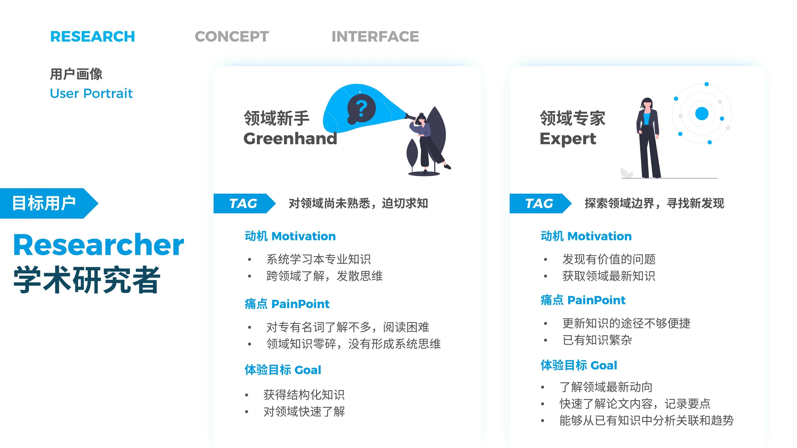
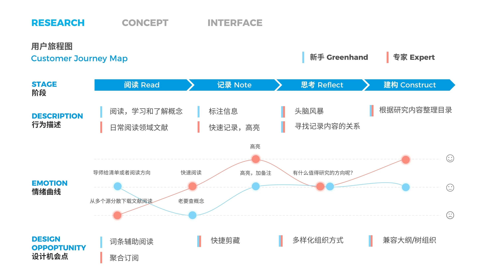

### 🔍 技术研究 – 知识图谱

知识图谱技术可以把概念、作者、出版物和引用关系转化成一种既适合人理解、也适合机器处理的数据结构。学术知识天然不是孤立文件，而是由概念和关系构成，因此知识图谱适合用于文献知识管理。

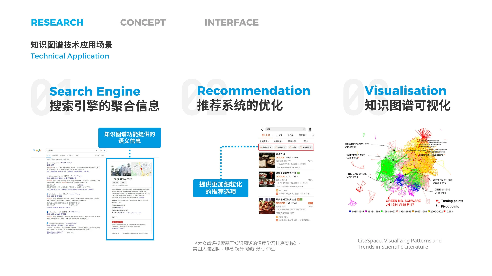
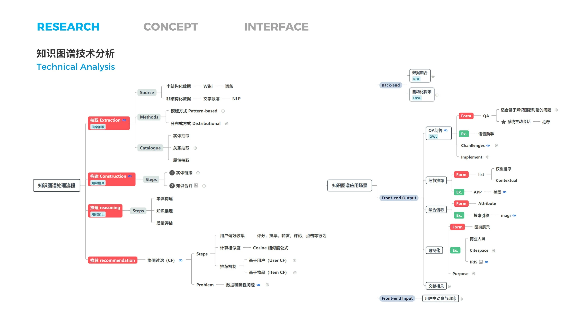

### 📖 竞品分析 – 知识管理工具

竞品分析覆盖了阅读工具、笔记工具和知识管理平台。PaperClip 的机会在于把完整研究流程连接起来：发现文献、阅读标注、整理卡片、分析关系，并最终支持研究方向的形成。

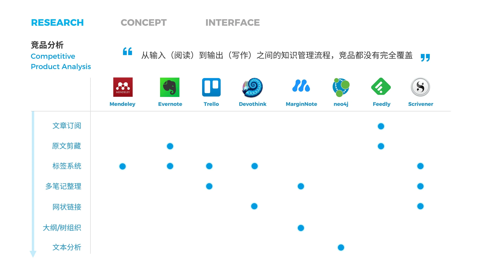

## 🎯 概念设计：从论文到知识网络

PaperClip 使用“卡片盒”的心智模型。每一段划线、笔记或提取出的观点都可以成为一张卡片。卡片可以被分组、链接和分析，让研究者逐步建立自己的知识网络，而不是只拥有一个静态的论文库。

### 🔨 产品框架

产品框架包含四个核心空间：订阅、笔记、画布和分析。它们共同支持从信息输入到洞察输出的完整研究流程。

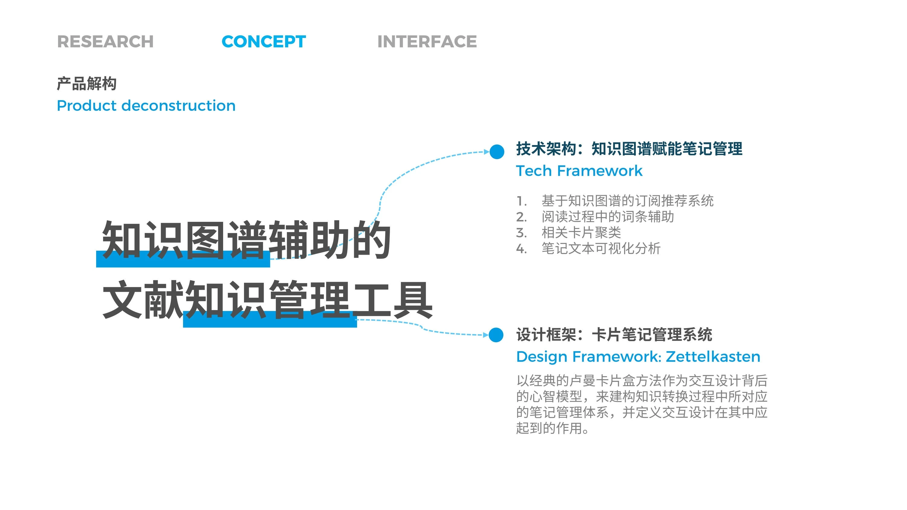
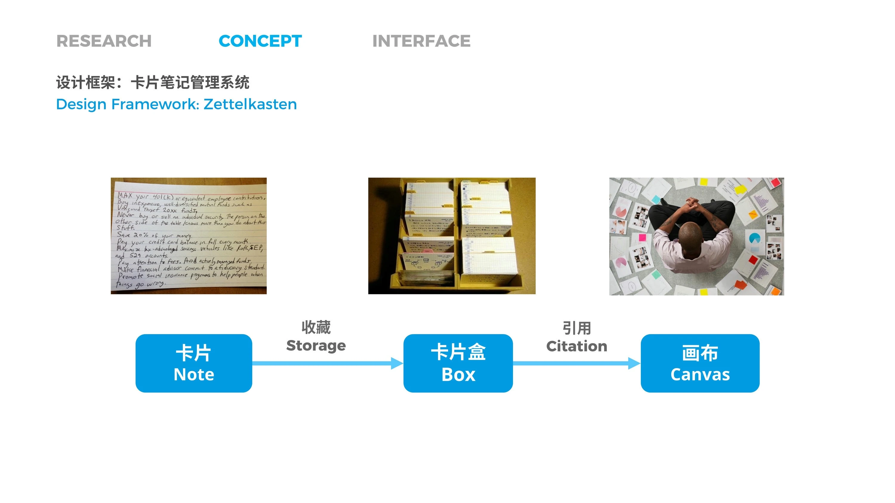
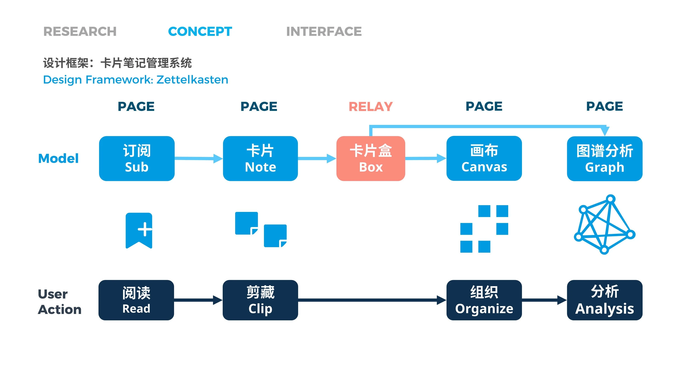

### 🔩 功能定义

功能围绕一个连续闭环展开：订阅相关论文，阅读并标注，将标注转化为卡片，在画布中组织卡片，再通过知识图谱分析发现关系和主题。

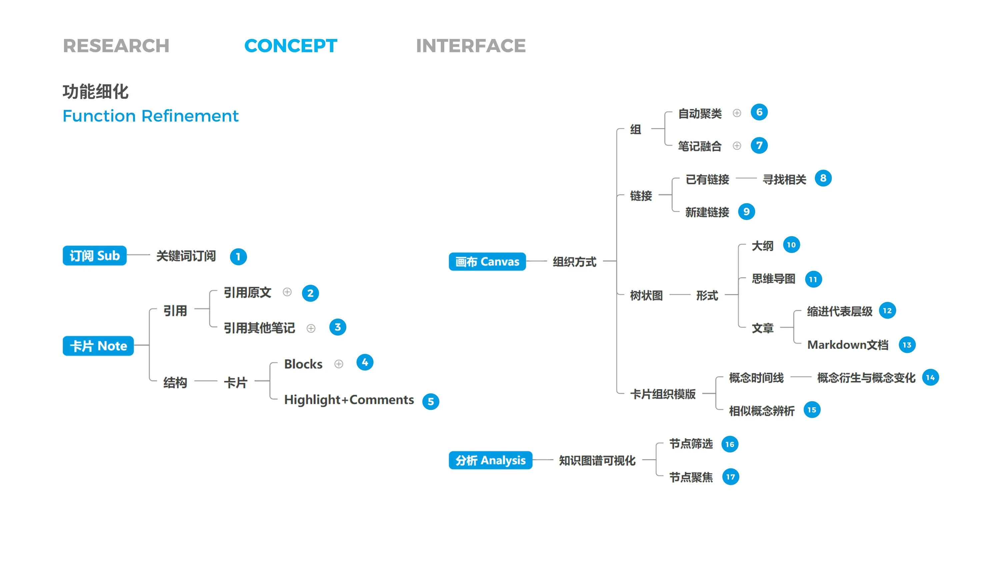
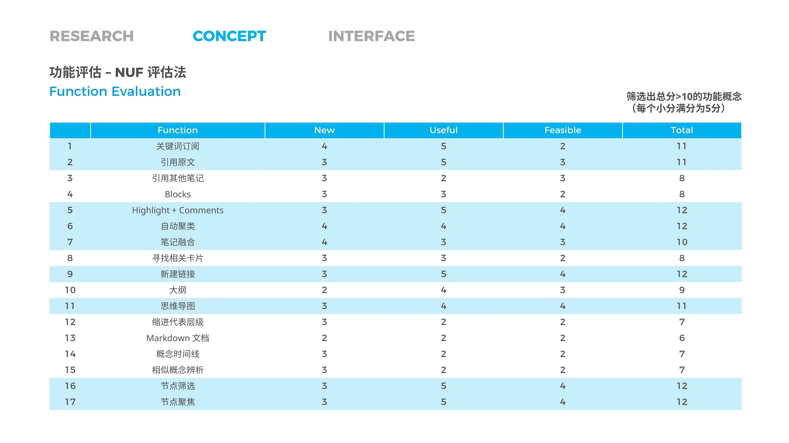

### 🔍 技术框架

技术框架连接论文元数据、用户笔记、知识卡片和图谱关系。系统不仅可以分析卡片中提到的概念，也可以分析这些卡片所关联的论文、作者和出版物信息。

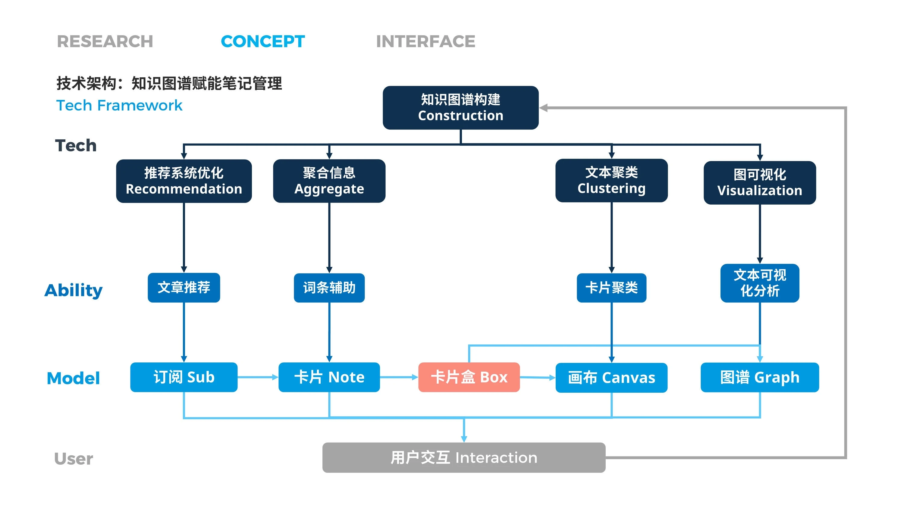

## 🎨 设计详情：支撑研究流程的四个空间

**订阅**：研究者可以通过关键词、作者或出版物订阅感兴趣的论文，让日常阅读来源更贴近正在进行的研究方向。

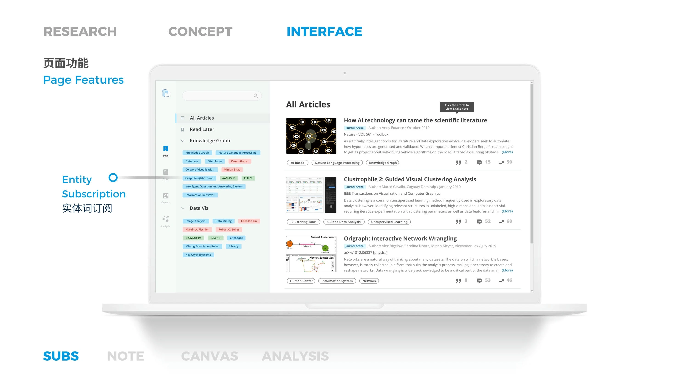

**笔记**：阅读过程中，研究者可以高亮文本、添加评论，并把重要片段提取成卡片。卡片保留了原文来源和个人理解之间的联系。

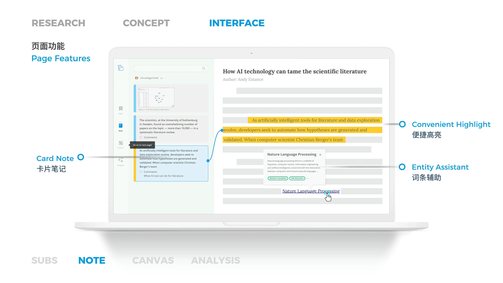

**画布**：画布用于自由组织卡片。研究者可以分组、连接和建立树状结构，用来探索概念之间的关系。

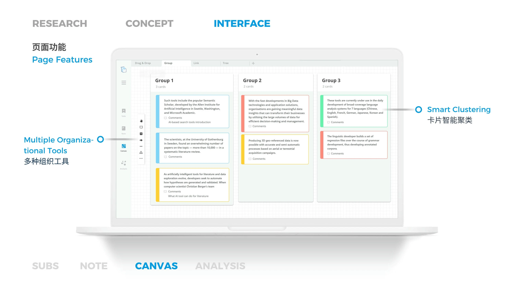

**分析**：研究者可以选择一组卡片生成知识图谱。系统会呈现概念、论文、作者和出版物之间的关系，帮助研究者识别潜在主题和研究方向。

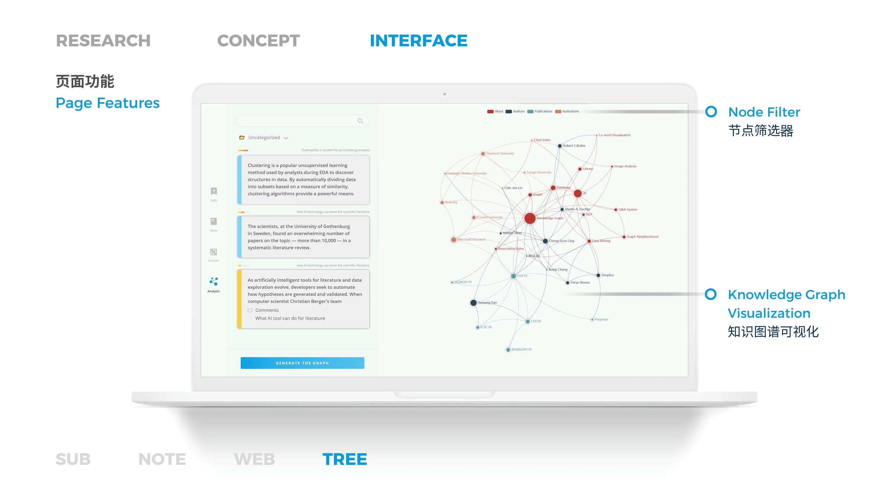

## 💡 总结：为思考而设计的研究工作台

PaperClip 不只是一个论文库，而是一个服务于学术思考的研究工作台。它把阅读、笔记、卡片、画布组织和图谱分析串联起来，帮助研究者把积累的文献转化为结构化知识，并支持选题早期的探索与判断。

如果你想了解更多关于这个项目的细节，可以观看上方完整介绍视频。
