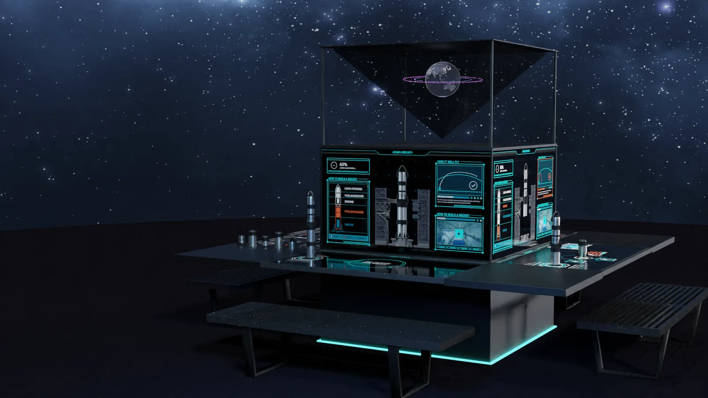
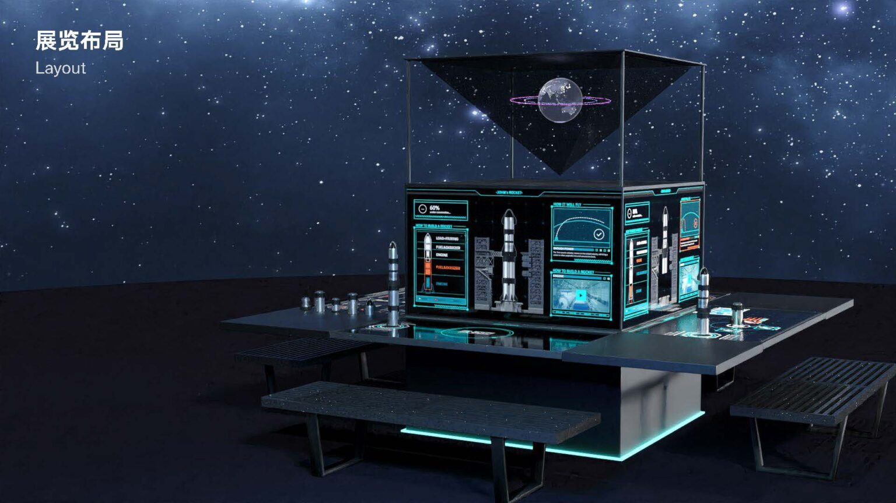
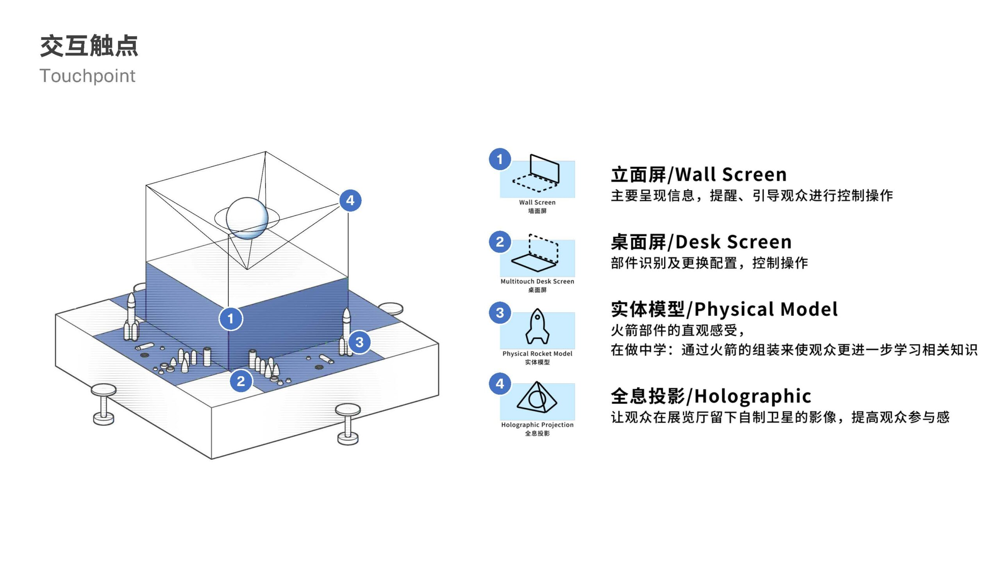
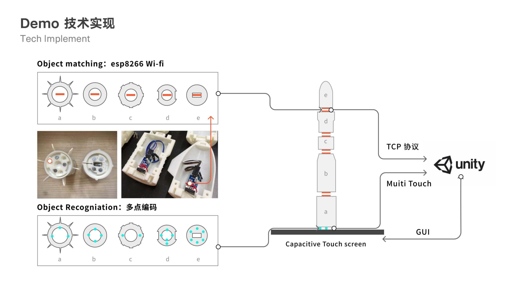
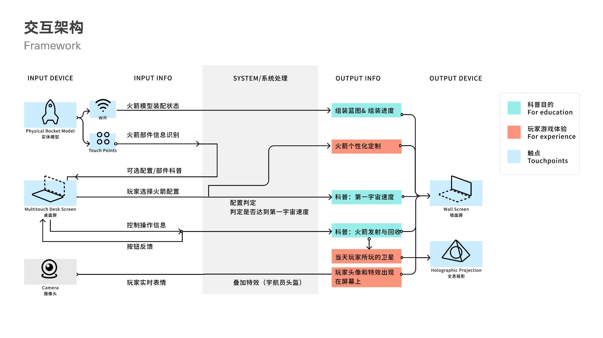
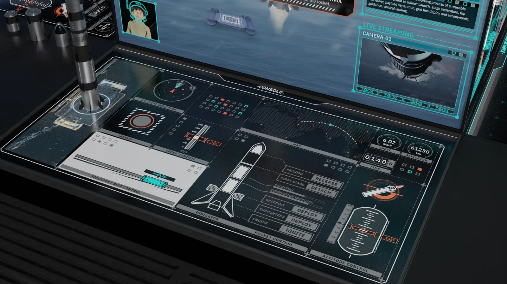
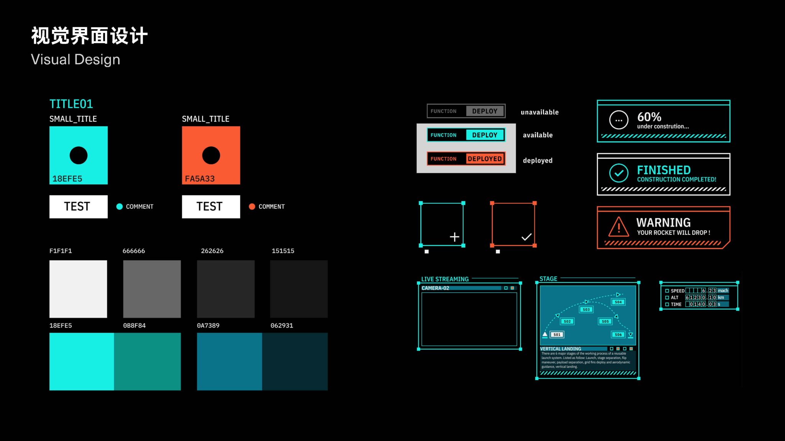

# Science Popularization Exhibition Design

This project explores how an exhibition can make scientific knowledge easier to approach through spatial storytelling, interactive touchpoints, and a clear visual system. The design translates abstract information into a visitor journey where people can move between observation, participation, and reflection.

The exhibition is designed as an immersive science scene. The dark spatial atmosphere, glowing information surfaces, and layered display devices create a setting where visitors can enter the topic through curiosity before reading detailed explanations.

## Layout and Touchpoints

The exhibition layout organizes content into a sequence of themed zones. Each touchpoint is designed to support a specific learning action: seeing a phenomenon, triggering an interaction, comparing data, or connecting the scientific principle to everyday life.

## Technical Implementation

The technical plan focuses on making interactions legible and reliable inside the exhibition environment. Hardware, screen content, sensing logic, and spatial placement are considered together so that visitors can understand what to do without additional explanation.

## Visual Design

The visual system uses consistent color, typography, iconography, and panel composition to connect different parts of the exhibition. The goal is to keep the science content clear while giving the whole space a recognizable identity.

## Summary

The final proposal combines spatial planning, interaction design, and graphic communication into a complete science exhibition experience. It is designed for visitors who may not have a technical background, but who can learn through movement, curiosity, and direct engagement.
