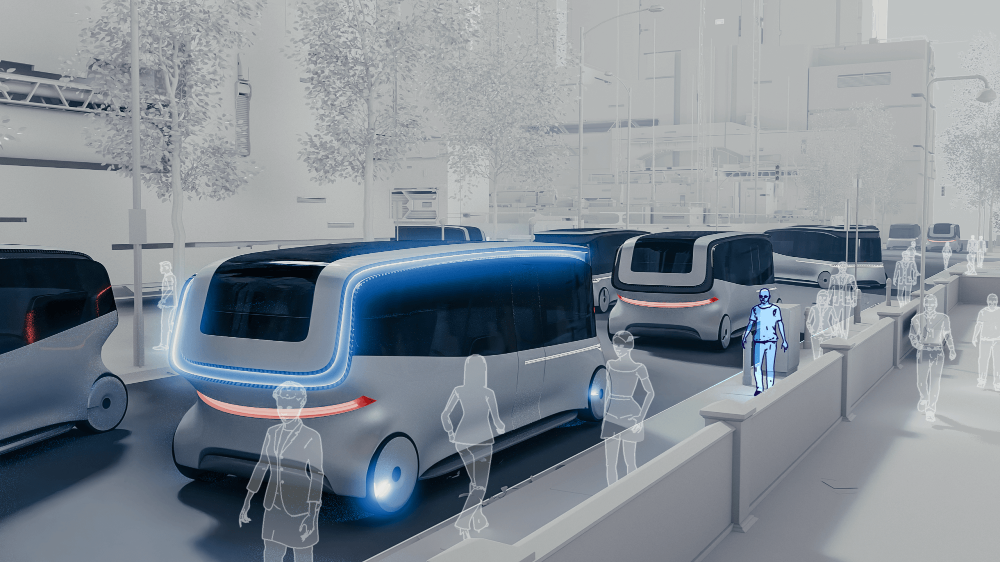
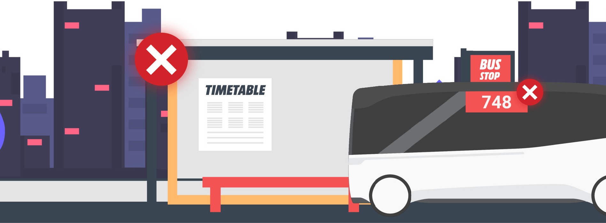
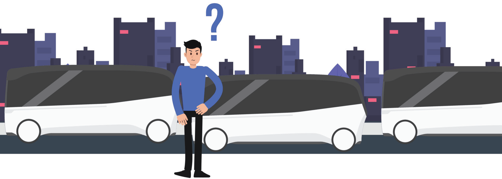
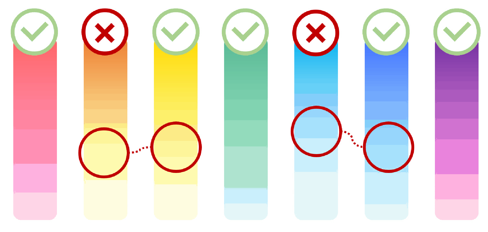
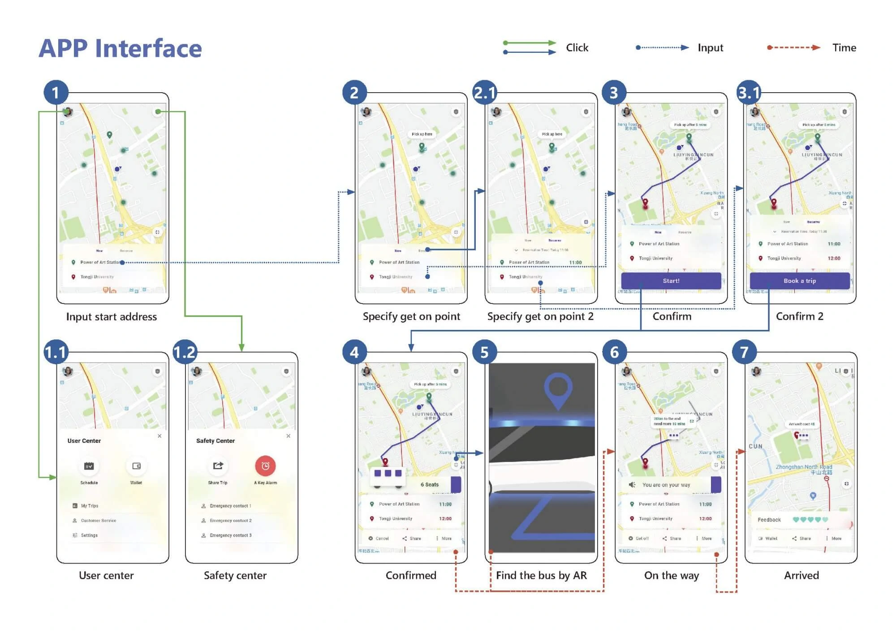
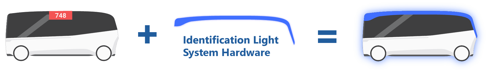
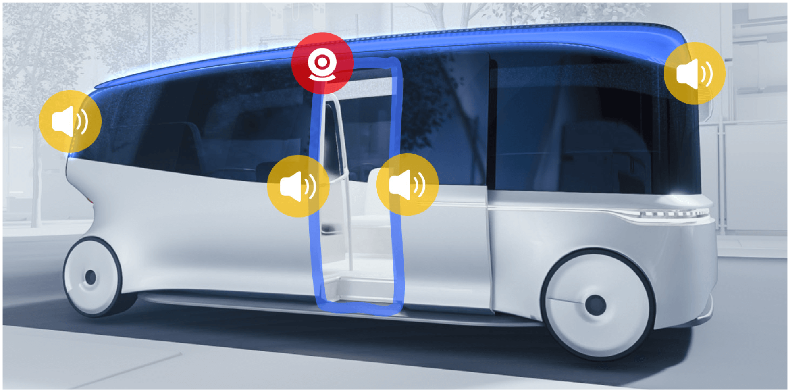
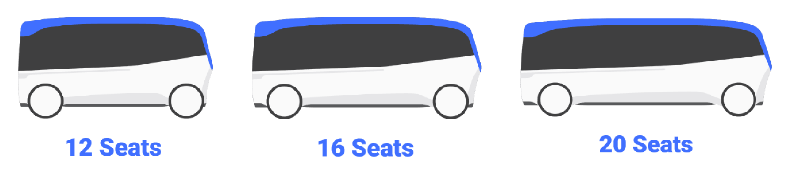

# Spotlight – Future Transit Recognition System

**_“Spotlight is a vehicle identification system for future dynamic public transit. It uses light, sound, and mobile AR to help passengers find the correct bus among many visually similar vehicles.”_**

## 🚌 Background: Future Bus Systems

### 🏙️ Urbanization

As urbanization continues, population density increases and environmental pressure becomes more visible. Public transportation will play a more important role because it uses road space more efficiently and can reduce the environmental impact of daily commuting.

### 🌐 Internet of Vehicles

With the development of 5G, big data, autonomous driving, and electrification, vehicles will become increasingly connected. Public transit systems may be able to respond to real-time passenger demand instead of relying only on fixed routes.

### 🚌 Future Bus System

In this future scenario, bus routes may become dynamic and on-demand. An intelligent transportation system can assign vehicles and routes according to real-time conditions.

Future buses may no longer follow fixed routes.

## 🎯 Target: The Identification Problem

A highly flexible public transportation system also creates a new problem. During peak hours, many vehicles with similar appearances may arrive at the same pickup area at the same time. Passengers need to identify the exact vehicle assigned to them quickly and confidently.

Spotlight responds to this problem with a vehicle identification system. The core signal is an additional light system on the vehicle, supported by mobile AR and directional sound. The design focuses on long-distance recognition, low cognitive load, privacy protection, and low retrofit cost.

## 📰 Storyboard: Experiencing Spotlight

### 📱 Pre-order

The experience is described through John, a future office worker. When John needs to travel, he books a vehicle in the app. After he enters the origin and destination, the system assigns a suitable pickup point, an intelligent bus, and a recognition color for the vehicle.

<video src="/posts/spotlight/img/SpotlightStoryboard-1_x264.mp4"></video>

### 🔍 Find the Bus

The bus arrives at the pickup point in advance and waits with a slow breathing light. When John reaches the pickup area, several similar buses may already be there. He raises his phone and uses AR to identify the assigned bus. The app darkens the camera view and highlights the correct vehicle when it appears on screen.

<video src="/posts/spotlight/img/SpotlightStoryboard-2_x264.mp4"></video>

### ✅ Confirmation

After John finds the assigned bus, AR also shows the fastest boarding route. As he gets closer, the breathing light becomes faster, creating a clear confirmation signal before he reaches the door.

<video src="/posts/spotlight/img/SpotlightStoryboard-3_x264.mp4"></video>

### 👆 Boarding

When John reaches the door, it opens automatically. As he steps onto the bus, green lights around the B-pillar and the step confirm that he is boarding the correct vehicle. If another passenger follows him onto the wrong bus, the door frame turns red and an error sound plays. When the vehicle departs, the top light turns off. At low speed, the bus plays a soft natural sound, such as waves, to make the moving vehicle noticeable without creating a harsh warning.

<video src="/posts/spotlight/img/SpotlightStoryboard-4_x264.mp4"></video>

### ❗ Warn Pedestrians

If a pedestrian blocks the driving path, the top light flashes red. The closer the vehicle is to the pedestrian, the faster the flashing becomes. The driving sound also becomes more intense, creating a multimodal warning.

<video src="/posts/spotlight/img/SpotlightStoryboard-5_x264.mp4"></video>

### 👇 Getting Off

When John reaches his destination and gets off, green lights and a confirmation sound appear again. If someone tries to get off at the wrong stop, red lights and an error sound warn them before they leave the vehicle.

<video src="/posts/spotlight/img/SpotlightStoryboard-6_x264.mp4"></video>

## 💡 Interaction: Solving the Identification Problem

Spotlight avoids asking passengers to read detailed information in a crowded pickup environment. Instead, it divides the identification task across several channels: AR helps the user locate the assigned vehicle, exterior light gives long-distance recognition, and sound provides immediate feedback during boarding, alighting, and pedestrian warning.

### ✨ Breathing Lights

Different breathing light animations represent different vehicle states, such as waiting, being approached, or warning. When the assigned passenger gets closer, the breathing rhythm accelerates, making the vehicle feel responsive without requiring the passenger to read text.

### ✅ Confirmation

The system uses consistent confirmation rules. Correct actions are reinforced with green light and a positive sound. Wrong boarding or wrong alighting is interrupted with red light and a warning sound. This reduces uncertainty at the moments where passengers are most likely to make mistakes.

### ❔ Why Light

We chose light instead of screens or text-heavy graphics for three reasons.

- **Long-distance recognizability**  
  Passengers should be able to identify the vehicle before standing next to it.
- **Privacy protection**  
  A screen that displays names, phone numbers, or personal labels would make identification easier, but it would also expose private information in public space.
- **Low cost**  
  Public transit needs affordable infrastructure. A light-based system can be added to existing vehicles without requiring a fully redesigned bus.

### 🎨 Light Color Selection

The selected colors need to be distinguishable and familiar. We began with the rainbow colors: red, orange, yellow, green, blue, indigo, and violet.

Three factors affect how users perceive light color: environmental color, light brightness, and color shift in the hardware. Based on this, orange was removed because it may be confused with yellow, and blue was removed because it may be confused with indigo. When many buses appear in the same place and five single colors are not enough, the system can also combine two colors to expand the recognition set.

### 📱 App Interface

## 💵 Business: Reducing System Cost

### **🛠️ Retrofitting Existing Buses**

The identification system can be implemented by retrofitting existing buses. Similar to shared bicycles, a service can either design a completely new vehicle or upgrade existing vehicles with networked hardware. Spotlight follows the second path: connect buses to the transit network and add identification lights. It does not depend on full autonomy to become useful.

### 📸 Identification Light System Hardware

- **Light strips**  
  Indirect light strips are placed on the top of the bus. Reflected light creates a softer and larger recognition area, improving visibility while reducing light pollution.
- **Camera**  
  A wide-angle facial recognition camera is placed above the door frame to identify passengers during boarding.
- **Speaker**  
  Multiple speakers are arranged around the top of the vehicle, allowing warnings to be perceived from different directions while reducing unnecessary disturbance.

### 🚌 Multiple Bus Sizes

Vehicle size and load capacity can change according to different regions, time periods, and route demands. This allows the transit system to distribute capacity more efficiently and adapt to a wider range of urban scenarios.

