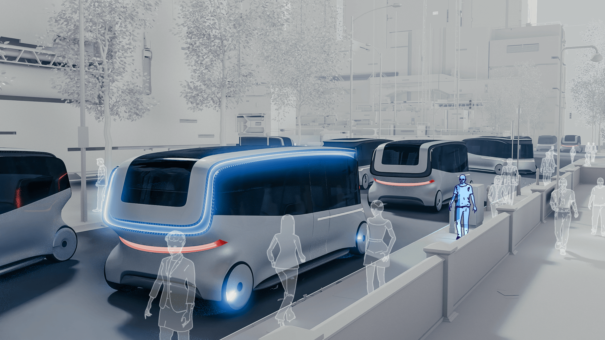
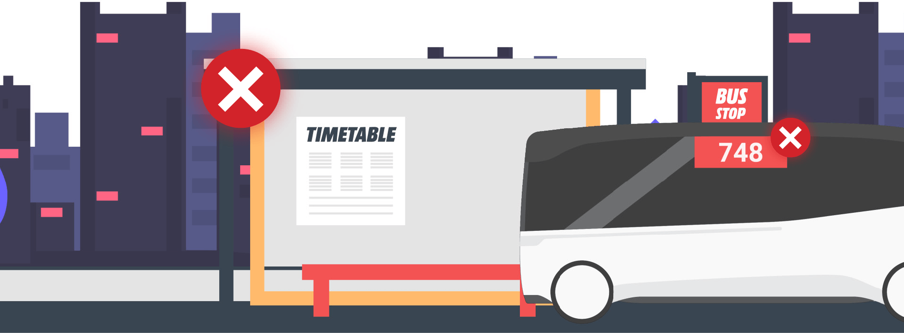
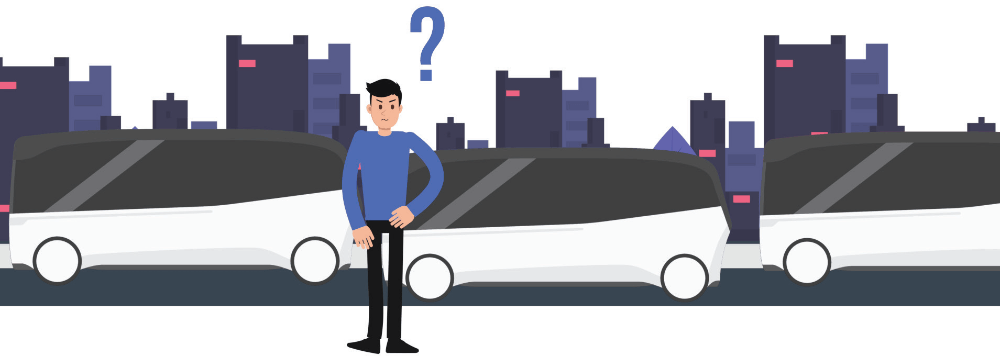
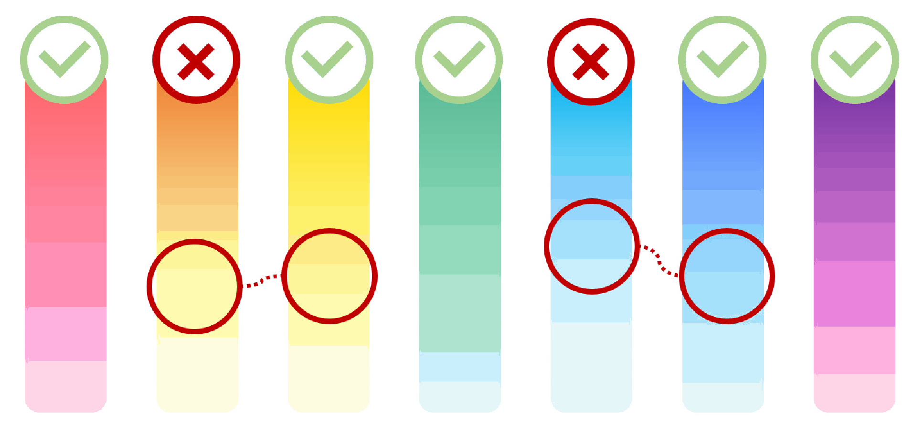
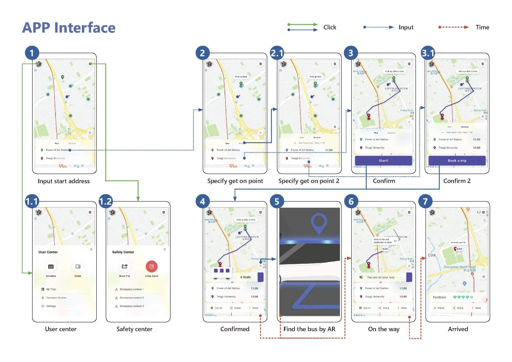
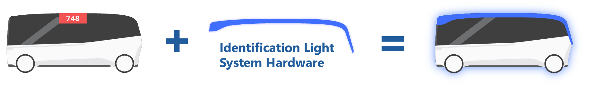
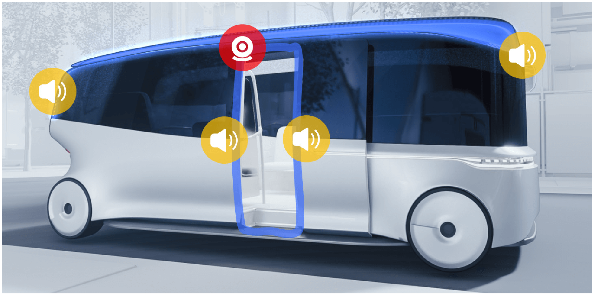
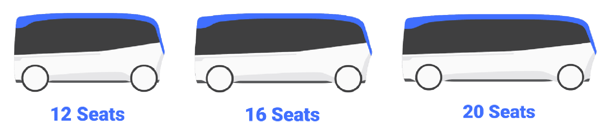

# Spotlight – 未来交通识别系统

**_"Spotlight 是一个基于未来智能路线规划公交服务的公共交通识别系统。该系统使用光、声音和 AR 帮助用户从众多相似车辆中识别他们预订的公交车。"_**

## 🚌 背景：未来公交系统

### 🏙️ 城市化

随着未来城市化进程加剧，人口密度激增，环境污染问题日益突出，人们的通勤将变得越来越成问题。空间利用率更高、更环保的公共交通在城市交通中扮演着越来越重要的角色。

### 🌐 车联网

随着 5G、大数据、自动驾驶和电气化等技术的发展，车联网将在不久的将来实现。

### 🚌 未来公交系统

未来公交线路将不再固定，而是智能交通系统根据实际情况灵活规划。

未来没有固定的公交线路

## 🎯 目标：识别问题

如此高度灵活的公共交通系统也会产生新问题。在高峰时段，许多外观相同的公交车会同时出现在同一地点。用户找到应该乘坐的正确公交车自然成了问题。

针对这样的问题，我们设计了一个车辆识别交互系统——Spotlight。它以车辆附加灯为核心，以移动 AR 识别和声音为补充。

## 📰 故事板：体验 Spotlight

### 📱 预订

我们从未来上班族 John 的角度体验这个系统。当 John 需要出行时，只需在 APP 中预订车辆，先输入起点，系统将分配最近的合理停车点。再输入终点，确认后系统将分配一辆在线智能公交车，在预定时间到预定地点接 John，并提示 John 注意公交车的颜色。

<video src="/posts/spotlight/img/SpotlightStoryboard-1_x264.mp4"></video>

### 🔍 寻找公交车

公交车会提前到达上车点等待 John，灯光缓慢呼吸表示停车。当 John 到达接车地点时，同一地点可能有多辆公交车。此时 John 可以举起手机，使用 APP 的 AR 功能辅助识别。此时手机界面变暗，当 John 预订的公交车出现在界面中时，AR 会高亮显示公交车以辅助 John 识别。

<video src="/posts/spotlight/img/SpotlightStoryboard-2_x264.mp4"></video>

### ✅ 确认

当 John 找到预订的公交车时，AR 还会提示最快的上车路线。当 John 靠近公交车时，灯光呼吸频率加快以提醒 John。

<video src="/posts/spotlight/img/SpotlightStoryboard-3_x264.mp4"></video>

### 👆 上车

当 John 到达车门时，车门自动为他打开。当 John 踏上踏板时，B 柱门框周围的绿灯和踏板会响起正确的提示音。如果有人跟随 John 上错车，B 柱门框周围会亮起红灯，并响起错误提示音以防止用户上错车。当车辆出发时，顶灯会熄灭。在低速行驶时，公交车也会持续播放柔和自然的声音以提醒车辆正在行驶。我们在这里选择了海浪的声音。

<video src="/posts/spotlight/img/SpotlightStoryboard-4_x264.mp4"></video>

### ❗ 警告行人

当路人阻挡行驶路线时，顶灯会闪烁红光，离路人越近，频闪越快。行驶声音（如海浪声）也会变得激烈以警告路人。

<video src="/posts/spotlight/img/SpotlightStoryboard-5_x264.mp4"></video>

### 👇 下车

John 的目的地到了。当 John 下车时，门框周围也会亮起绿灯并响起正确的提示音。如果有人跟随 John 但在错误的地方下车，门框周围会亮起红灯，并响起错误提示音以防止她下错车。

<video src="/posts/spotlight/img/SpotlightStoryboard-6_x264.mp4"></video>

## 💡 交互：识别问题的解决方案

### ✨ 呼吸灯

我们有不同的灯光呼吸动画来表示车辆状态，辅助用户找车等。图片是公交车停靠时的呼吸灯。随着用户靠近，呼吸速度会逐渐加快。

### ✅ 如何确认

当用户成功登上正确的公交车并在正确的目的地时，门框周围的灯光会是绿灯并响起正确的提示音。如果用户成功登上错误的公交车并在错误的目的地，会有红灯和警告提示音。

### ❔ 为什么选择灯光

让我们解释一下为什么我们放弃屏幕、图形等元素，而是使用基本的颜色区分和灯光亮度来帮助用户找到公交车。

- **出色的远距离可识别性**  
  不用说，用户肯定不想靠近车辆才能确认是否是要乘坐的车。
- **隐私保护**  
  如果使用屏幕和图文提示用户，并且用户需要轻松识别，不可避免地会涉及用户名或屏幕名称、手机号码等信息，这也难以接受。
- **低成本**  
  从用户角度来看，选择公共交通出行的原因很明显，因为公共交通足够便宜且负担得起。这也要求我们在改造系统时尽可能控制成本。

### 🎨 灯光颜色的选择

具体到颜色选择，我们应该选择足够可区分且对用户足够熟悉的颜色。自然地，我们首先想到彩虹色：红、橙、黄、绿、蓝、靛、紫。

有三个因素会影响用户看到的灯光颜色：环境颜色、灯光亮度、灯光设备的色偏。所以我们去掉了可能与黄色混淆的橙色，以及可能与靛色混淆的蓝色。

### 📱 APP 界面

## 💵 商业：降低系统成本

### **🛠️ 现有公交车改造**

我们的识别系统可以通过改造现有公交车来实现。以共享单车为例，从一开始就设计一辆新车（如摩拜）是好的。也可以通过联网传统车型并添加一些硬件（如 ofo）来实现。我们的解决方案也可以通过将公交车连接到公交联网系统并添加识别灯来实现。不一定需要无人驾驶等先进技术。

### 📸 识别灯系统硬件

- **灯带**  
  非直射灯带布置在公交车顶部，帮助用户找到公交车。通过反射，光线变得更柔和，识别区域更大，提高了可识别性并减少了光污染。
- **摄像头**  
  门框上方还布置了广角人脸识别摄像头来识别用户。
- **扬声器**  
  我们在顶部周围布置了几个扬声器，确保各个方向的行人都能被提醒，并且提醒可以有一定的方向性，减少干扰。

### 🚌 多种公交车尺寸

车身尺寸和载重能力也可以根据不同地区、不同时间段和不同路线的需求进行改变，以实现更优化的分配，适应更广泛的场景。

