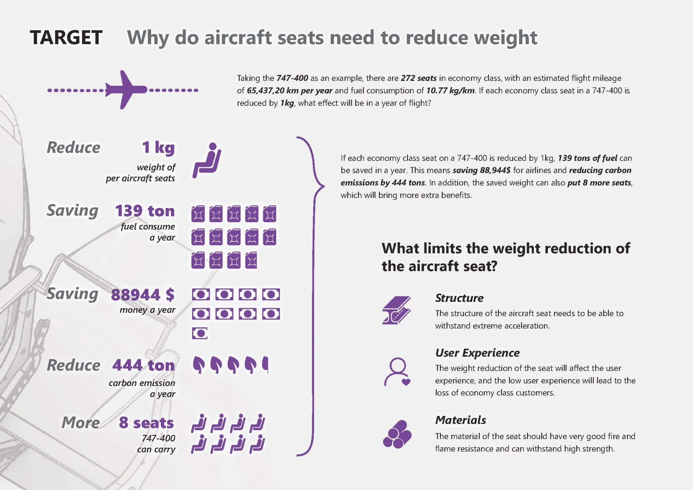
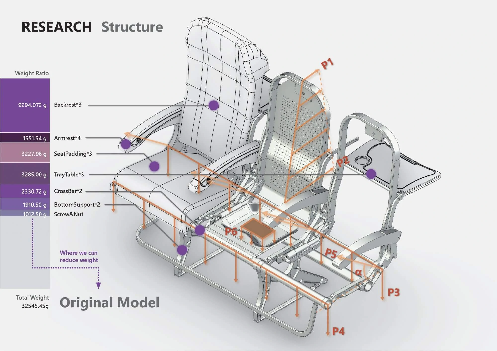
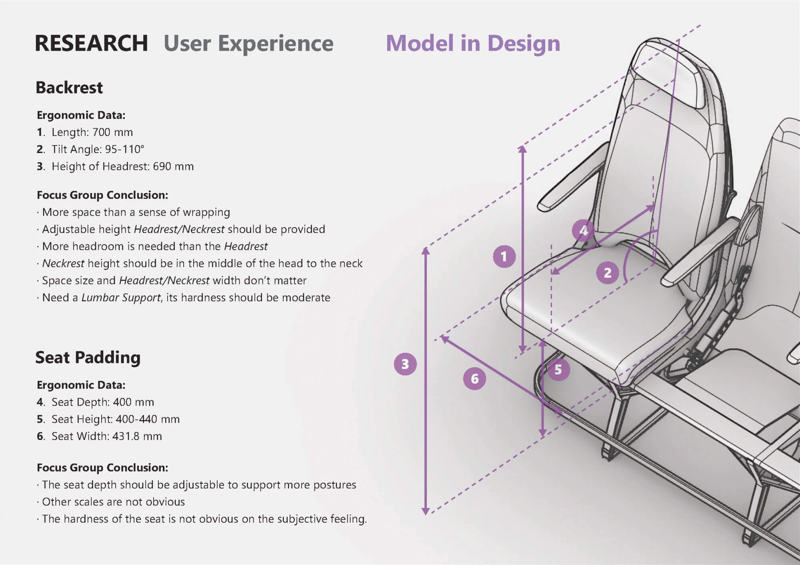
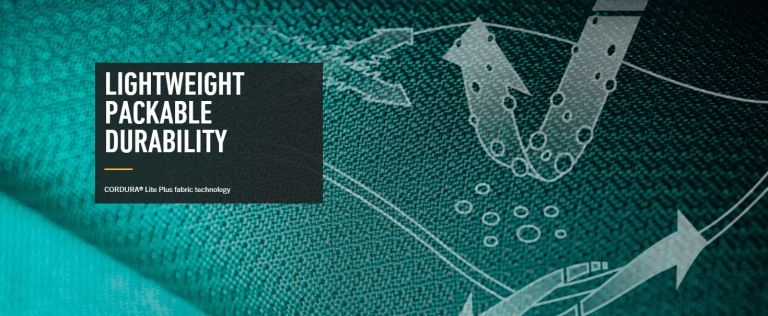
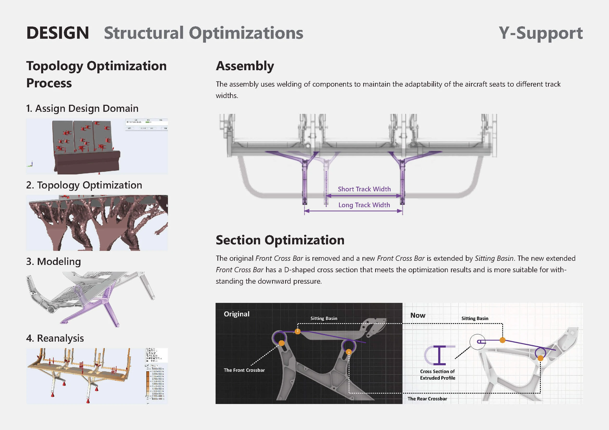
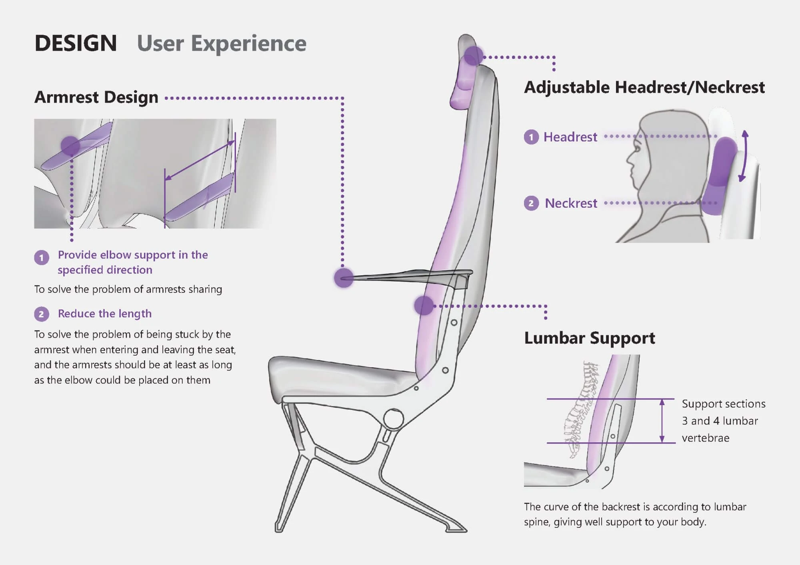
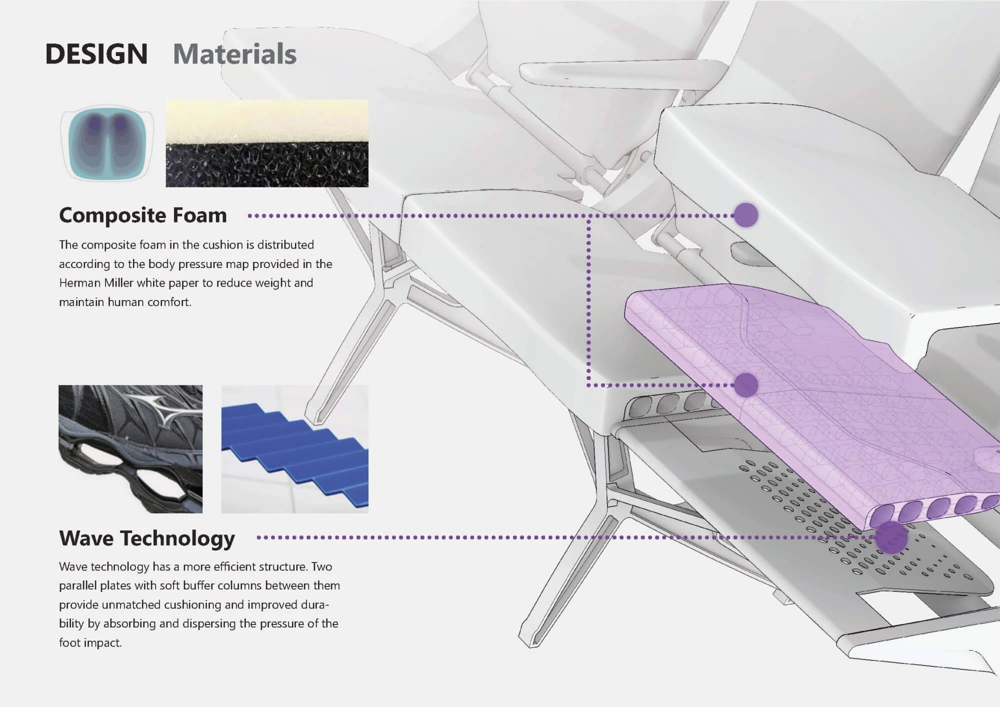

# Minimalism – Aircraft Seats Lightweight Design

Minimalism is the lightweight design of aircraft seats, which based on balancing 3 factors: **_structure_**, **_materials_**, and **_user experience_**.

<video src="./img/AircraftSeats.mp4"></video>

## 🎯 TARGET: Why do aircraft seats need to reduce weight?

---

Taking ✈️ the Boeing-747 as an example, there are 💺 272 seats in economy class, with an estimated flight mileage of 65,437,20 km per year and fuel consumption of ⛽10.77 kg per km.

If each economy class seat on a 747-400 is reduced by 1kg,  
⛽ **139 tons of fuel** can be saved in a year.  
💵 **88,944$** will be saved for airlines.  
🏭 **444 tons of carbon emissions** will be reduced.  
💺 **8 more seats** can be put on a 747-400.  
if we save those weights, which will bring more extra benefits.

Whether from an environmental standpoint or from the business interests of airlines, it is very important to reduce the weight of aircraft seats.

## 📚 RESEARCH: What limits the weight reduction of the aircraft seat

---

### 🔧 Structure

_The structure of the aircraft seat needs to be able to withstand extreme acceleration from all directions._

For the structure of the aircraft seat, we managed to get the weight data of the aircraft seat (original model) and the Chinese national safety standard for aircraft seats (SAE AS 8049B). With the help of civil and mechanical engineering students, the following graphs show the results of the analysis of the data (weight and forces). The colored part shows that we can reduce the weight of the airplane seat.

Aircraft seats (Original Model) weight & force analysis diagram

### 👨 User Experience

_The weight reduction of the seat will affect the user experience, and the low user experience will lead to the loss of economy class customers._

From the perspectives of ergonomics and user demands, we conducted ergonomic scale research on airplane seats and Focus Group for airplane passengers. Here are some of the results from the user experience study.

Aircraft seats ergonomics data & Focus Group Conclusions

### 🧱 Materials

_The material of the seat should have very good fire and flame resistance and can withstand high strength._

In terms of materials, it is also regulated by the Chinese national safety standards for aircraft seats (SAE AS 8049B). On the basis of standards, to find new materials from companies such as DuPont from the perspective of lightweight. We also considered the possibility of metal frames with new materials.

## 🎨 DESIGN: How to reduce the weight of aircraft seats?

---

### 💺 Appearance

<iframe style="width: 100%; aspect-ratio: 16/12;" src="/posts/minimalism/xr/ModelD0611_XR.46.html" frameborder="0">
</iframe>

### 🔧 Structure

**Y-shaped chair legs**

Get guidance from topologically optimized form, and use two fork trusses to provide more direct support for the basin.

**Optimization of the cross-section structure of the front beam:**

The bending of the sheet metal is carried out by extending the scale forward and inserting a longitudinal welded plate. This creates an I-shaped cross-sectional structure which is more resistant to bending overall , and results in a more uniform stress distribution in the basin.

**The internal structure of the backrest uses a Y-shaped mesh distribution:**

We use the structure of a badminton racket as the frame part. The cross section of the frame uses an inner curved section to spread the impact force to the whole frame.

### 👨 User Experience

The shape of the handrail is implied to divide the area of the user on both sides, the part of the backrest near the spine is close to the body curve, providing better support

### 🧱 Materials

Cushion and backrest use composite sponge structure, and density distribution according to sitting pressure. Inspired by sneakers, use wavy sections to distribute pressure

